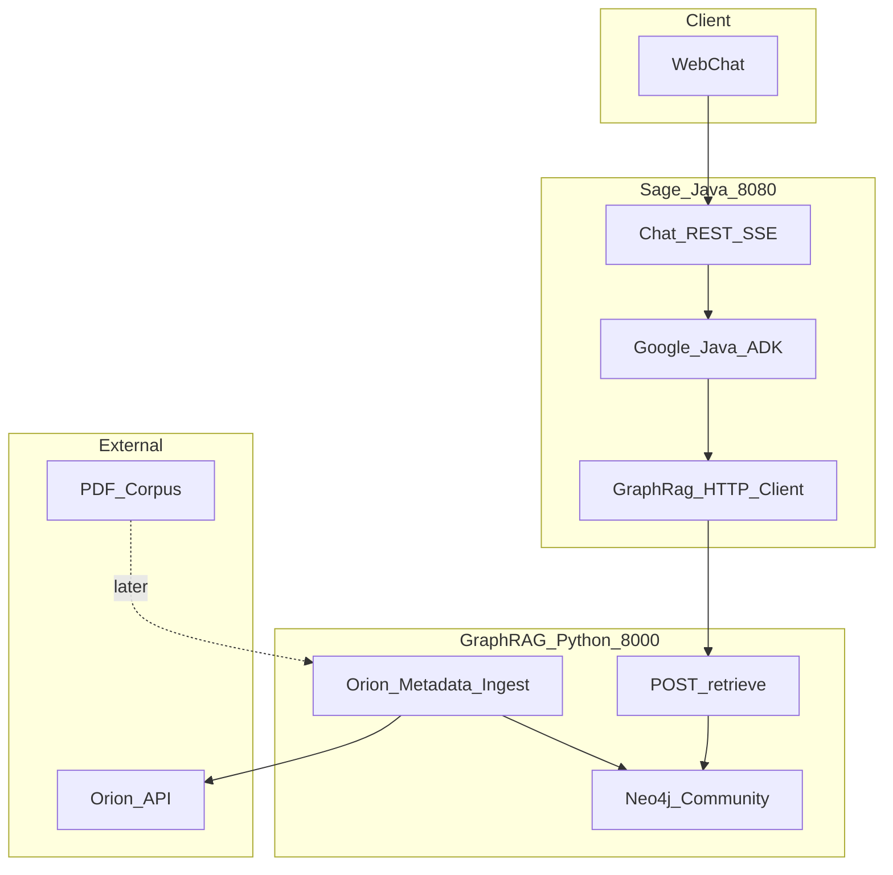
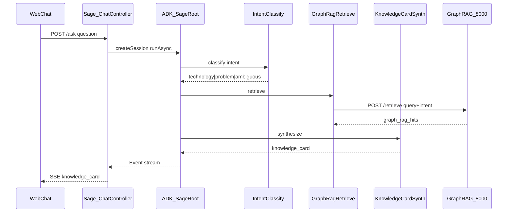
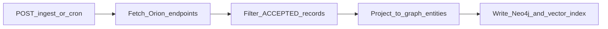

# Architecture

> **Product scope:** [feature-document.md](../feature-document.md)  
> **Related:** [google-java-adk-usage.md](google-java-adk-usage.md), [orion-api-documentation.md](orion-api-documentation.md)

---

## Table of Contents

1. [Purpose & scope](#1-purpose--scope)
2. [Project structure](#2-project-structure)
3. [Architectural principles](#3-architectural-principles)
4. [System context](#4-system-context)
5. [Service boundaries](#5-service-boundaries)
6. [Orion ingest vs ask-time](#6-orion-ingest-vs-ask-time)
7. [Orion API mapping (ingest only)](#7-orion-api-mapping-ingest-only)
8. [Metadata → graph](#8-metadata--graph)
9. [Ask-time request lifecycle](#9-ask-time-request-lifecycle)
10. [Orion-metadata ingest lifecycle](#10-orion-metadata-ingest-lifecycle)
11. [Knowledge Card contract](#11-knowledge-card-contract)
12. [Inter-service API contracts](#12-inter-service-api-contracts)
13. [Failure modes & degradation](#13-failure-modes--degradation)
14. [Security & privacy](#14-security--privacy)
15. [Deployment topology](#15-deployment-topology)
16. [Observability](#16-observability)
17. [Testing & evaluation](#17-testing--evaluation)
18. [Feature traceability](#18-feature-traceability)

---

## 1. Purpose & scope

Sage is an internal **expertise-locator + prior-art concierge**. Given a technical question, it answers:

> *Who here already solved this, and where is the proof?*

This document specifies:

- Two-service architecture (Java Sage + Python Graph RAG)
- Orion used **only at ingest** (Python → own Neo4j store); never from Java at ask-time
- Inter-service HTTP contracts (what Java needs from Graph RAG)
- Agent orchestration boundaries (detail in [google-java-adk-usage.md](google-java-adk-usage.md))

**Out of scope here:** Neo4j Cypher schema / node label design, PDF ingest and enrichment (later).

---

## 2. Project structure

### Runtime versions

| Component | Version / choice |
|-----------|------------------|
| Java | **25** (LTS) |
| Spring Boot | **4.1** (Spring Framework 7.x via Boot) |
| Google Java ADK | 1.5.0 (+ LangChain4j bridge for local LLM) |
| Graph store | **Neo4j Community Edition** (Docker, free / GPLv3) |
| Graph RAG service | Python · FastAPI |
| Local LLM | Ollama (on-network) |

### Repository layout

```text
sage-ai/
├── feature-document.md              # Product scope and acceptance criteria
├── docs/
│   ├── architecture.md              # This document — system boundaries and contracts
│   ├── google-java-adk-usage.md     # ADK agent tree, tools, and wiring
│   ├── orion-api-documentation.md   # Orion HTTP API reference (ingest source)
│   └── RAG_Design.md                # Draft RAG internals — not authoritative
├── postman/                         # Orion fixtures for Python ingest stub/offline mode
│   ├── sage ai.postman_collection.json
│   └── *.json                       # Captured response payloads
│
├── sage/                            # Java 25 · Spring Boot 4.1 · Google ADK (:8080)
│   └── src/main/java/com/company/sage/
│       ├── SageApplication.java
│       ├── chat/                    # POST /ask, SSE streaming
│       ├── clients/graphrag/        # GraphRagApiClient → /retrieve, /health
│       ├── model/                   # KnowledgeCard, RetrieveHit DTOs, Intent enum
│       └── adk/                     # IntentClassify, GraphRagRetrieve, Synth, factory
│
└── graph-rag-service/               # Python — FastAPI (:8000)
    └── app/
        ├── main.py                  # FastAPI entry
        ├── api/                     # /retrieve, /ingest, /health
        ├── ingest/                  # Orion sync (PDF ingest later)
        ├── retrieval/               # Vector + graph traversal
        └── store/                   # Neo4j + vector index (internal)
```

**Boundary rule:** Java owns ask orchestration and intent classification. Python owns Orion ingest, Neo4j, and retrieval. Both share only HTTP contracts defined in [§12](#12-inter-service-api-contracts). Java has **no** Orion client.

---

## 3. Architectural principles

| Principle | Meaning for Sage |
|-----------|------------------|
| **Route-first** | Lead with team/person + document; generation only summarizes retrieved evidence |
| **Evidence-only synthesis** | Never invent teams, people, or documents; prefer extractive `passage` / indexed summary over LLM paraphrase |
| **Ingest once, query own store** | Orion is copied into Neo4j at ingest; ask-time never calls Orion |
| **Intent then retrieve** | Classify question as technology / problem / ambiguous, then bias Graph RAG similarity |
| **Fail-soft retrieval** | Graph RAG failure → empty hits; synth still produces an honest gap card |
| **On-network LLM** | Company data and inference stay on-network |
| **Single-turn asks** | One `Session` per question; discard after response |
| **Clear service boundaries** | Java owns ask + intent; Python owns Orion ingest, Neo4j, `/retrieve` |

---

## 4. System context



| User need | System response |
|-----------|-----------------|
| Who solved this? | Team + people from Graph RAG hit metadata (ingested from Orion) |
| Where is the proof? | `fileName` / `ticketLink` and citations from `/retrieve` hits |
| What was the approach? | Extractive `passage` (indexed Orion summary / graph context) |
| Similar tech or problems? | Intent-biased similarity over Neo4j-backed index |
| Nothing found? | Knowledge Card gap flag — candidate Hard Problem |

---

## 5. Service boundaries

### Sage — Java (`:8080`)

| Responsibility | Technology |
|----------------|------------|
| Public API (`POST /ask`, SSE) | Spring Boot **4.1** · Java **25** |
| Agent orchestration | Google Java ADK 1.5.0 |
| Intent classification | ADK `IntentClassify` → `technology` \| `problem` \| `ambiguous` |
| Graph RAG HTTP client | `GraphRagApiClient` → `POST /retrieve` |
| Knowledge Card synthesis | ADK `KnowledgeCardSynth` |
| Web chat UI | Spring-served frontend |
| Eval entrypoint | Same `POST /ask` path |

**Does not own:** Orion HTTP, graph index build, Neo4j, PDF parsing, embedding models.

### Graph RAG — Python (`:8000`)

| Responsibility | Technology |
|----------------|------------|
| Orion metadata **ingest/sync** | FastAPI (sole Orion consumer) |
| PDF ingest | Deferred |
| Knowledge graph + vector index | **Neo4j Community** (+ vector index internal) |
| Retrieval API | `POST /retrieve` (intent-aware, card-complete hits) |
| Ingest trigger | `POST /ingest` |
| Health | `GET /health` |

**Does not own:** ask orchestration, Knowledge Card rendering, public chat API.

### Why two services?

| Reason | Detail |
|--------|--------|
| Language fit | Python has mature Graph RAG tooling; Java ADK is required for agent orchestration |
| Independent deployment | Upgrade retrieval / Neo4j without rebuilding Sage |
| Single Orion owner | Only Python touches Orion — avoids dual clients and divergent freshness |
| Contract stability | Replace retriever by updating Java HTTP client only |

---

## 6. Orion ingest vs ask-time

Orion is used in **one lifecycle only**. Ask-time reads the owned store via Graph RAG.

| Lifecycle | Owner | When | Touches Orion? | Output |
|-----------|-------|------|----------------|--------|
| **Ingest** | Python Graph RAG | One-shot / scheduled / `POST /ingest` | **Yes** — all captured endpoints | Neo4j nodes/edges + vector embeddings |
| **Ask** | Java ADK | Every `POST /ask` | **No** — only `POST /retrieve` | Knowledge Card from card-complete hits |

Knowledge Card fields come from the **`/retrieve` hit projection**, not live Orion. Freshness is bounded by last ingest sync.

Agent wiring detail: [google-java-adk-usage.md](google-java-adk-usage.md).

---

## 7. Orion API mapping (ingest only)

The feature document names **Nexus** and **Orion** as separate sources. Postman fixtures show **only Orion hosts** (`apiorion.talentica.com`, `apidev-orion.talentica.com`). Requests with `Origin: https://nexus.talentica.com` are the Nexus UI calling Orion — not a separate REST API.

| Role | Orion endpoint | Ask-time owner | Ingest owner | Feeds Knowledge Card via |
|------|----------------|----------------|--------------|--------------------------|
| Expertise + summary + doc handle | `GET /valueAdd/valueAddsByTag?tag={tag}` | **N/A (Java)** | **Python** | `/retrieve` metadata + passage |
| Tech coverage | `GET /technology/getTechDigest/label?techDigestLabel={label}` | **N/A (Java)** | **Python** | `/retrieve` evidence |
| Taxonomy | `GET /tech/categories` | **N/A (Java)** | **Python** | Index vocabulary / similarity |
| Hard-problems catalog | `GET /customers/valueAdd/hardProblemsFinancialYear?cycleId={ids}` | **N/A (Java)** | **Python** | Problem-intent similarity, eval goldens |

Full API reference: [orion-api-documentation.md](orion-api-documentation.md). Stub/offline ingest reads `postman/*.json`.

### Primary ingest payload — `valueAddsByTag`

| Payload section | Key fields | Card role (after ingest) |
|-----------------|------------|--------------------------|
| `fileDetails` | `title`, `summary`, `fileName`, `techDigests`, `tags` | Direct answer, summary, document handle, evidence |
| `customersValueAdd` | `ownerId[]`, `teamId`, `teamLeads[]`, `status`, `type`, `ticketLink` | People, teams, citations, filtering |

**Rule:** Prefer indexed extractive summary as-is — do not regenerate with LLM when present.

**Do not** load the full hard-problems JSON (~6 MB) into LLM context at ask-time. Filter at ingest / retrieve; pass only matched hit records to synthesis.

---

## 8. Metadata → graph

Orion metadata feeds the Python Neo4j store. This section defines **what goes in**, not Neo4j schema (labels, Cypher, or property maps).

| Orion field | Conceptual graph role |
|-------------|----------------------|
| `customersValueAdd.teamId` | Team entity |
| `ownerId[]`, `teamLeads[]` | Person entities; membership links |
| `fileDetails.techDigests`, `tags` | Technology / tag entities |
| `fileDetails.title`, `summary` | Value-add / problem properties |
| `fileName`, `ticketLink`, `infoLink` | Document / citation |
| `status`, `type` | Ingest filter — prefer `ACCEPTED`; exclude `REJECTED` |
| `customersValueAdd.id` | Stable key for incremental sync |

Graph traversal, embedding model, and Neo4j schema are internal to the Python service. This document defines ingest **inputs** and `/retrieve` **output contract** only.

### Value of graph over live Orion alone

- Multi-hop queries (team → technology → related value adds)
- Synonym / tag normalization across records
- Similar technology and similar hard-problem discovery via intent-biased retrieval
- Natural-language retrieval without ask-time tag derivation against Orion

---

## 9. Ask-time request lifecycle



1. Client sends `POST /ask` with natural-language question.
2. Sage creates request-scoped ADK `Session`.
3. `IntentClassify` sets intent: `technology` | `problem` | `ambiguous`.
4. `GraphRagRetrieve` calls `POST /retrieve` with the full question and intent.
5. `KnowledgeCardSynth` merges hit metadata into Knowledge Card JSON.
6. Sage streams card to UI as SSE.
7. Session discarded.

| Environment | P95 target |
|-------------|------------|
| Development (local model) | < 8 s |
| Production | < 3 s |

---

## 10. Orion-metadata ingest lifecycle

Owned by **Graph RAG Python**. Java does not trigger ingest on the default ask path.



| Orion endpoint | Sync purpose |
|----------------|--------------|
| `valueAddsByTag` | Per known tag from `tech/categories` vocabulary |
| `hardProblemsFinancialYear` | Full catalog seed |
| `tech/categories` | Taxonomy refresh |
| `getTechDigest/label` | Per known tech-digest label |

Incremental sync keys records by `customersValueAdd.id`. Re-sync on schedule or `POST /ingest` trigger. PDF enrichment of summaries is later — not required for POC ingest of Orion metadata.

---

## 11. Knowledge Card contract

| Field | Primary source | Fallback |
|-------|----------------|----------|
| Direct answer | Synth from hit titles + counts | — |
| Team(s) + people | `/retrieve` `metadata.teams`, `metadata.people` | — |
| Evidence / confidence | Hit count + score bands ([below](#evidence-confidence)) | — |
| Summary | **`hits[].passage`** (extractive indexed summary) | "no formal summary — reach out to team" |
| Full document | `metadata.fileName` / ticket link | "no formal doc — reach out to team" |
| Honesty / gap flag | Synth when `hits` empty | — |

### Evidence confidence

| Condition | `evidenceConfidence` |
|-----------|----------------------|
| ≥ 2 hits with `score` ≥ 0.85 | `HIGH` |
| ≥ 1 hit with `score` ≥ 0.70 | `MEDIUM` |
| ≥ 1 hit below 0.70 (above `min_score`) | `LOW` |
| No hits | `NONE` — `gapFlag=true` |

```json
{
  "directAnswer": "Yes — Rupeek migrated observability to OpenTelemetry.",
  "teams": [{ "teamId": "52", "name": "Rupeek" }],
  "people": [{ "personId": "65", "name": "Hemant Sachdeva" }],
  "evidenceConfidence": "HIGH",
  "summary": "From indexed Orion summary via hits[].passage — do not paraphrase when present.",
  "documentLinks": [{ "docId": "1046", "fileName": "Rupeek Mail - Observability @Rupeek.pdf" }],
  "gapFlag": false,
  "sources": { "graphRag": true },
  "intent": "technology"
}
```

---

## 12. Inter-service API contracts

### Sage Java — public

#### `POST /ask`

| | |
|---|---|
| **Request** | `{ "question": "string" }` |
| **Response** | `text/event-stream` — event `knowledge_card` with JSON body |

#### `GET /health`

→ `{ "status": "ok", "graphRagReachable": true|false }`

### Graph RAG Python — APIs Java needs

#### `POST /retrieve`

Card-complete retrieval so Java never needs Orion.

```json
// Request
{
  "query": "How did we migrate to OpenTelemetry?",
  "intent": "technology",
  "top_k": 5,
  "min_score": 0.70
}

// Response 200
{
  "hits": [{
    "doc_id": "178025",
    "source": "orion_metadata",
    "passage": "Extractive text from indexed Orion summary or graph context.",
    "score": 0.91,
    "metadata": {
      "title": "Application monitoring platform from NewRelic to OpenTelemetry",
      "teams": [{ "teamId": "52", "name": "Rupeek" }],
      "people": [{ "personId": "65", "name": "Hemant Sachdeva" }],
      "technologies": ["OpenTelemetry", "Prometheus", "Grafana"],
      "fileName": "Rupeek Mail - Observability @Rupeek.pdf",
      "ticketLink": "https://...",
      "status": "ACCEPTED"
    }
  }],
  "query_time_ms": 340,
  "total_found": 2
}
```

| Field | Rules |
|-------|--------|
| `intent` | Required enum: `technology` \| `problem` \| `ambiguous` — biases similarity toward tech vs hard-problem neighborhoods |
| `hits` | Always an array — never `null` |
| Empty result | `200` with `hits: []` |
| `passage` | Extractive — not LLM-paraphrased at the API boundary |
| `metadata` | Must include teams, people, title, technologies, and document handle when known so the Knowledge Card can be built without Orion |

#### `POST /ingest`

Owned and triggered by Graph RAG ops / cron. **Java does not call this** on the default ask path.

```json
{ "mode": "orion_metadata", "force_refresh": false }
```

→ `202 Accepted` `{ "job_id": "...", "status": "started" }`

#### `GET /health`

→ `{ "status": "ok", "last_orion_sync": "ISO-8601", "indexed_records": 1204, "neo4j_reachable": true }`

### Orion — external (Python ingest only)

See [orion-api-documentation.md](orion-api-documentation.md). Stub mode reads `postman/*.json`; live mode uses `ORION_API_KEY` and `ORION_AUTH_TOKEN` on the **Python** service only.

---

## 13. Failure modes & degradation

| Scenario | Sage behavior | User experience |
|----------|---------------|-----------------|
| Graph RAG down | `graph_rag_hits = []`; synth continues | `gapFlag=true` — honest no-answer |
| Neo4j down (inside Graph RAG) | `/retrieve` errors or empty; Java fail-soft | Same as Graph RAG down |
| Intent classify uncertain | Pass `intent: ambiguous` to `/retrieve` | Broader similarity; may lower confidence |
| Empty hits | `gapFlag=true` | Honest no-answer — candidate Hard Problem |

**Never** fabricate teams, people, or documents when hits are empty. There is **no** live Orion fallback.

---

## 14. Security & privacy

| Data | Location | External egress |
|------|----------|-----------------|
| User questions | Request-scoped session — discarded | Never |
| Employee names (from hits) | Session state — discarded | Never |
| LLM prompts + completions | Local Ollama / on-network endpoint | Never |

| Service | Secrets |
|---------|---------|
| Sage Java | `SAGE_GRAPH_RAG_BASE_URL` only (no Orion credentials) |
| Graph RAG Python | `ORION_API_KEY`, `ORION_AUTH_TOKEN` (ingest-sync only); Neo4j auth if configured |

Never hardcode cookies or API keys. Treat `postman/` fixtures as confidential.

---

## 15. Deployment topology

```text
:8080  sage-java      Spring Boot 4.1 + ADK + Web Chat (Java 25)
:8000  graph-rag      FastAPI + Neo4j client + retrieval
:7687  neo4j          Neo4j Community Edition (Docker)
:11434 ollama         Local LLM for ADK agents
```

| Variable | Service | Default |
|----------|---------|---------|
| `SAGE_GRAPH_RAG_BASE_URL` | Java | `http://localhost:8000` |
| `OLLAMA_BASE_URL` | Java | `http://localhost:11434` |
| `ORION_API_KEY` | Python | `stub` |
| `ORION_AUTH_TOKEN` | Python | — |
| `NEO4J_URI` | Python | `bolt://localhost:7687` |

---

## 16. Observability

| Service | Rate | Errors | Duration |
|---------|------|--------|----------|
| Sage `POST /ask` | asks/min | 5xx, gap-flag rate | P50/P95 end-to-end |
| Intent classify | — | invalid/missing intent | classify latency |
| Graph RAG `POST /retrieve` | queries/min | 5xx, empty-hit rate | P95 retrieve latency |
| Orion ingest (Python) | syncs/day | HTTP errors, timeouts | per-endpoint latency |

Generate `correlationId` per ask; propagate to Graph RAG client and logs.

---

## 17. Testing & evaluation

| Component | Stub behavior |
|-----------|---------------|
| Graph RAG client | Mock or local Python with seeded Neo4j index |
| Orion ingest | Python maps to `postman/*.json` fixtures |
| ADK agents | Full tree against stub `retrieveFromGraph` |

Eval calls the **same** `POST /ask` entrypoint as the product UI. Assert: no hallucinated names, `gapFlag=true` for out-of-domain queries, intent passed on retrieve, P95 < 8 s.

---

## 18. Feature traceability

| Feature | Description | Primary owner | Key components |
|---------|-------------|---------------|----------------|
| **F1** | Ask → Knowledge Card | Sage Java | `ChatController`, `SageRoot`, `KnowledgeCardSynth` |
| **F2** | Similar tech / problem blend | Sage + Graph RAG | `IntentClassify` + intent-biased `/retrieve` |
| **F3** | Expertise routing | Graph RAG → Sage | Hit `metadata.teams` / `people` |
| **F4** | Document retrieval & summary | Graph RAG → Sage | `passage`, `fileName` / ticket link |
| **F5** | Honest no-answer + gap flag | Sage Java | `KnowledgeCardSynth` |
| **F6** | Web chat interface | Sage Java | SSE streaming |
| **F7** | Ingestion | Graph RAG Python | Orion-metadata sync → Neo4j (PDF later) |
| **F8** | Evaluation | Sage Java | Promptfoo → `POST /ask` |
