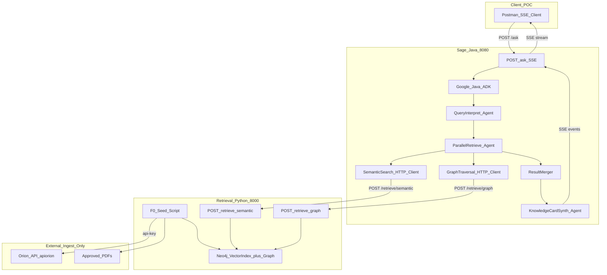
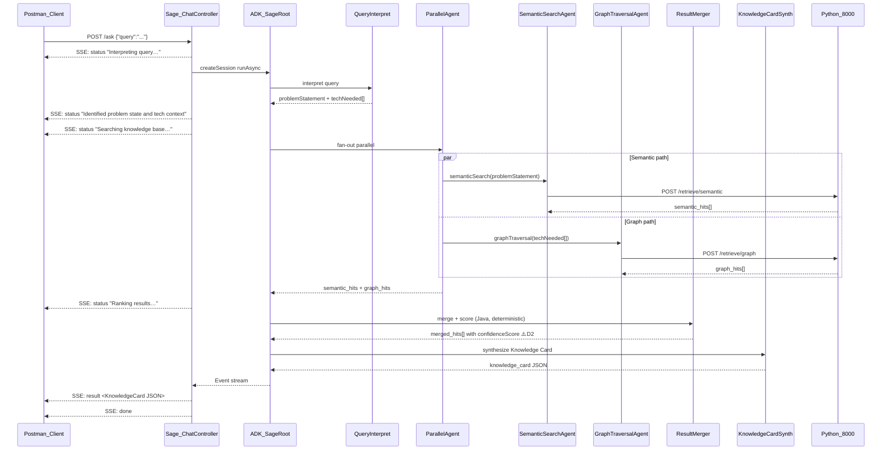
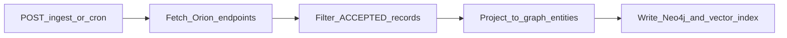

# Architecture

> **Product scope:** [feature-document.md](feature-document.md)  
> **Related:** [google-java-adk-usage.md](google-java-adk-usage.md), [orion-api-documentation.md](orion-api-documentation.md)  
> **Last updated:** Jul 16 2026 — reflects query interpretation, parallel hybrid search (semantic + Graph RAG), confidence scoring, Postman/SSE client, Neo4j-only DB

---

## ⚠️ Decisions Required Before Implementation

The following items are **open and blocking**. Implementation of the components that depend on them must not start until resolved.

| # | Decision | Blocks | Owner |
|---|---|---|---|
| D1 | **Local LLM + hardware** — which model (e.g. `llama3.2:3b`, `mistral`) on which machine? | Latency targets, ADK `LangChain4jChatModel` config, embedding model choice | Project lead |
| D2 | **Confidence score weights** — `w1` (vector similarity) vs `w2` (graph score), boost value for dual-match results, minimum threshold to suppress a result | Python `/retrieve/semantic` + `/retrieve/graph` merge logic, F3 scoring | Tech lead |
| D3 | **Top-N result count** — default is 5; confirm | Python `/retrieve` `top_k` default, Knowledge Card `results[]` size | Project lead |
| D4 | **`cycleId` values** — confirm `cycleId=8,7` covers all relevant financial cycles for the seed | F0 seed script, data coverage of gap-fill pass | Data / Orion access owner |
| D5 | **Orion `api-key` validity** — confirm `53e72eed-6f0b-4d5b-9cc5-088487d969b9` is current and stable for POC duration | F0 seed script, all Python ingest | Orion access owner |
| D6 | **Re-seed endpoint** — is `POST /admin/reseed` required for the POC, or is running the seed script manually sufficient? | Python service scope, DevOps | Project lead |

---

---

## Table of Contents

1. [Purpose & scope](#1-purpose--scope)
2. [Project structure](#2-project-structure)
3. [Architectural principles](#3-architectural-principles)
4. [System context](#4-system-context)
5. [Service boundaries](#5-service-boundaries)
6. [Orion ingest vs ask-time](#6-orion-ingest-vs-ask-time)
7. [Orion API mapping (ingest only)](#7-orion-api-mapping-ingest-only)
8. [Metadata → graph](#8-metadata--graph)
9. [Ask-time request lifecycle](#9-ask-time-request-lifecycle)
10. [Orion-metadata ingest lifecycle](#10-orion-metadata-ingest-lifecycle)
11. [Knowledge Card contract](#11-knowledge-card-contract)
12. [Inter-service API contracts](#12-inter-service-api-contracts)
13. [Failure modes & degradation](#13-failure-modes--degradation)
14. [Security & privacy](#14-security--privacy)
15. [Deployment topology](#15-deployment-topology)
16. [Observability](#16-observability)
17. [Testing & evaluation](#17-testing--evaluation)
18. [Feature traceability](#18-feature-traceability)

---

## 1. Purpose & scope

Sage is an internal **expertise-locator + prior-art concierge**. Given a technical question, it answers:

> *Who here already solved this, and where is the proof?*

This document specifies:

- Two-service architecture (Java Sage + Python Graph RAG / Search)
- Orion API used **only at ingest** (Python seed script → Neo4j); never called at ask-time
- Ask-time pipeline: query interpretation → parallel hybrid search (semantic + Graph RAG) → confidence scoring → Knowledge Card → SSE stream to Postman
- Inter-service HTTP contracts (what Java needs from the Python retrieval service)
- Agent orchestration boundaries (detail in [google-java-adk-usage.md](google-java-adk-usage.md))

**Out of scope here:** Neo4j Cypher schema / property maps (Python internal), PDF chunking strategy, embedding model internals.

**Nexus clarification:** Nexus (`nexus.talentica.com`) is a web portal that calls the Orion API. There is no separate Nexus backend. Sage uses the Orion API directly with `api-key` authentication.

---

## 2. Project structure

### Runtime versions

| Component | Version / choice |
|-----------|------------------|
| Java | **21** (LTS; Spring Boot 4.1 supports 17–26 — bump to 25 when toolchain is available) |
| Spring Boot | **4.1** (Spring Framework 7.x via Boot) |
| Google Java ADK | 1.5.0 (+ LangChain4j bridge for local LLM) |
| Graph store | **Neo4j Community Edition** (Docker, free / GPLv3) |
| Graph RAG service | Python · FastAPI |
| Local LLM | Ollama (on-network) |

### Repository layout

```text
sage-ai/                             # Maven project root (this repo)
├── pom.xml                          # Java 21 · Spring Boot 4.1 · Google ADK
├── docs/
│   ├── feature-document.md          # Product scope and acceptance criteria
│   ├── SPEC.md                      # Master index
│   ├── architecture.md              # This document — system boundaries and contracts
│   ├── google-java-adk-usage.md     # ADK agent tree, tools, and wiring
│   ├── orion-api-documentation.md   # Orion HTTP API reference (ingest source)
│   └── contracts/                   # ask-api.md + retrieve-api.md (no nested README)
├── orion-apis/                      # Postman: Orion ingest + Sage ask/retrieve
│   └── sage ai.postman_collection.json
│
├── src/main/java/com/company/sage/  # Ask orchestration (:8080)
│   ├── SageApplication.java
│   ├── chat/                        # POST /ask, SSE streaming
│   ├── clients/graphrag/            # HTTP clients → /retrieve/semantic, /retrieve/graph, /health
│   ├── model/                       # KnowledgeCard, RetrieveHit DTOs
│   ├── adk/
│   │   ├── SageAgents.java          # Agent factory (SequentialAgent SageRoot)
│   │   ├── agents/                  # QueryInterpret, SemanticSearch, GraphTraversal, Synth
│   │   └── tools/                   # SemanticSearch, GraphTraversal, ResultMerger FunctionTools
│   ├── merge/                       # Deterministic ResultMerger scoring logic
│   └── config/                      # LLM / retrieval / scoring Spring config
├── src/main/resources/
│   └── application.yml
└── src/test/java/com/company/sage/
    └── SageApplicationTests.java

# Separate service (not in this Maven module) — Python FastAPI (:8000)
# graph-rag-service/                 # Owns Neo4j docker-compose, schema, retrieve APIs
#   ├── docker-compose.yml           # Neo4j (+ optional graph-rag container)
#   ├── GraphRAG_Schema_Data_Ingestion.md
#   └── app/ … ingest, retrieval, Neo4j store
```

**Boundary rule:** Java owns ask orchestration and intent classification. Python owns Orion ingest, Neo4j, and retrieval. Both share only HTTP contracts defined in [§12](#12-inter-service-api-contracts) and [contracts/](contracts/). Java has **no** Orion client. Neo4j is started only from `graph-rag-service`, never from this repo.

---

## 3. Architectural principles

| Principle | Meaning for Sage |
|-----------|------------------|
| **Route-first** | Lead with team/person + document; generation only summarizes retrieved evidence |
| **Evidence-only synthesis** | Never invent teams, people, or documents; prefer extractive `passage` / indexed summary over LLM paraphrase |
| **Ingest once, query own store** | Orion API is seeded into Neo4j once; ask-time never calls Orion |
| **Interpret then parallel-retrieve** | LLM splits query into `problemStatement` + `techNeeded[]`; drives parallel semantic search + Graph RAG traversal simultaneously |
| **Hybrid search — both paths** | Semantic search (vector similarity on problem descriptions) runs in parallel with Graph RAG traversal (tech tags → graph). Results merged and ranked by confidence score. Neither path alone is sufficient — they cover each other's blind spots |
| **Confidence-scored results** | Every result carries a `confidenceScore` (0–1); results surfaced by both paths get a boost *(⚠️ D2 — weights TBD)* |
| **Fail-soft retrieval** | Either search path failing → empty hits from that path; the other path still contributes; synth produces an honest gap card if both empty |
| **On-network LLM** | Company data and inference stay on-network |
| **Single-turn asks** | One `Session` per question; discard after response |
| **Clear service boundaries** | Java owns ask orchestration + SSE; Python owns Orion seed, Neo4j, semantic search, graph traversal, confidence scoring |

---

## 4. System context



| User need | System response |
|-----------|-----------------|
| Who solved this? | Team + people from merged search hits (seeded from Orion into Neo4j) |
| Where is the proof? | `documentLink` / `ticketLink` from hit metadata |
| What was the approach? | Extractive `summary` from indexed Orion summary or PDF chunk |
| Similar tech or problem? | Parallel: semantic search on `problemStatement` + graph traversal on `techNeeded[]` |
| Confidence? | Per-result `confidenceScore` (0–1) — ranked descending |
| Nothing found? | `gapFlag: true` — candidate Hard Problem callout |

---

## 5. Service boundaries

### Sage — Java (`:8080`)

| Responsibility | Technology |
|----------------|------------|
| Public API (`POST /ask`, SSE) | Spring Boot **4.1** · Java **21** |
| Agent orchestration | Google Java ADK 1.5.0 |
| **Query interpretation** | ADK `QueryInterpret` → `problemStatement` + `techNeeded[]` |
| **Parallel search fan-out** | ADK `ParallelAgent` → `SemanticSearchAgent` + `GraphTraversalAgent` |
| **Result merge + confidence score** | `ResultMerger` (pure Java, deterministic) |
| Knowledge Card synthesis | ADK `KnowledgeCardSynth` |
| SSE streaming | Spring `SseEmitter` — emits `status` / `result` / `done` events to Postman |
| Eval entrypoint | Same `POST /ask` path |

> **Web chat UI:** deferred post-POC. POC client is Postman only.

**Does not own:** Orion HTTP, Neo4j, PDF parsing, embedding models, semantic search logic, graph traversal logic.

Spring AI is excluded from the ask path (would overlap ADK). See [spec-coverage-map.md](spec-coverage-map.md) §3.

### Retrieval Service — Python (`:8000`)

| Responsibility | Technology |
|----------------|------------|
| **Orion + PDF seed script (F0)** | Python script — sole Orion consumer, run once before first ask |
| **Semantic search** | `POST /retrieve/semantic` — Neo4j vector index query on `problemStatement` |
| **Graph RAG traversal** | `POST /retrieve/graph` — Cypher traversal on `techNeeded[]` tags |
| Knowledge graph + vector index | **Neo4j Community Edition** (single store for both — decided, see §9.2 in feature doc) |
| Health | `GET /health` |
| Optional re-seed trigger | `POST /admin/reseed` *(⚠️ D6 — required for POC?)* |

**Does not own:** ask orchestration, result merging, Knowledge Card rendering, public chat API, confidence score calculation (that is Java `ResultMerger`).

### Why two services?

| Reason | Detail |
|--------|--------|
| Language fit | Python has mature Neo4j + vector tooling; Java ADK required for agent orchestration |
| Independent deployment | Upgrade Neo4j / retrieval logic without rebuilding Sage Java |
| Single Orion owner | Only Python seed script touches Orion — no dual clients |
| Contract stability | Swap retrieval implementation by updating Java HTTP clients only |

---

## 6. Orion API — ingest only (never at ask-time)

Orion API is used in **one lifecycle only — ingest**. Ask-time reads the pre-built Neo4j store.

| Lifecycle | Owner | When | Touches Orion API? | Output |
|-----------|-------|------|----------------|--------|
| **Ingest (F0)** | Python seed script | Once before first ask *(⚠️ D4, D5)* | **Yes** — all 4 endpoints in fan-out order | Neo4j nodes/edges + vector embeddings |
| **Ask** | Java ADK | Every `POST /ask` | **No** — calls `POST /retrieve/semantic` + `POST /retrieve/graph` only | Knowledge Card from merged, scored hits |

**There is no live Orion fallback at ask-time.** If Neo4j is empty or retrieval fails, Sage returns `gapFlag: true`.

Knowledge Card fields come from hit projections returned by the Python retrieval service. Freshness is bounded by last seed run.

**Ingest fan-out order (F0 seed script):**

```
Step 1: GET /tech/categories              → seed Technology nodes (vocabulary)
        ↓  for each tag, in parallel:
Step 2: GET /valueAdd/valueAddsByTag?tag= → HardProblem, Team, Person, Document nodes + edges
Step 3: GET /technology/getTechDigest/label?techDigestLabel= → enrich Technology with coverage
        ↓  gap-fill:
Step 4: GET /customers/valueAdd/hardProblemsFinancialYear?cycleId=8,7  ⚠️ D4
```

Agent wiring detail: [google-java-adk-usage.md](google-java-adk-usage.md).

---

## 7. Orion API mapping (ingest only)

**Nexus is the web portal that calls Orion. There is no separate Nexus API.** Requests with `Origin: https://nexus.talentica.com` in the Postman collection are Nexus UI traffic hitting Orion — Sage uses the same endpoints directly with `api-key` auth.

| Ingest step | Orion endpoint | Neo4j output | Notes |
|-------------|----------------|--------------|-------|
| 1 (first) | `GET /tech/categories` | `Technology` nodes | Drives fan-out vocabulary |
| 2 (parallel) | `GET /valueAdd/valueAddsByTag?tag={tag}` | `HardProblem`, `Team`, `Person`, `Document` nodes + all edges | Primary rich-data source |
| 3 (parallel) | `GET /technology/getTechDigest/label?techDigestLabel={label}` | Enrich `Technology` nodes | Coverage context |
| 4 (gap-fill) | `GET /customers/valueAdd/hardProblemsFinancialYear?cycleId=8,7` | Any remaining `HardProblem` nodes | ⚠️ D4 — confirm cycleId |

Full API reference: [orion-api-documentation.md](orion-api-documentation.md). Offline seed may use captured payloads derived from [`orion-apis/sage ai.postman_collection.json`](../orion-apis/sage%20ai.postman_collection.json) (collection only is committed).

### Primary ingest payload — `valueAddsByTag`

| Payload section | Key fields | Neo4j role |
|-----------------|------------|------------|
| `fileDetails` | `title`, `summary`, `fileName`, `techDigests`, `tags` | `HardProblem` properties; `summary` embedded for vector search |
| `customersValueAdd` | `ownerId[]`, `teamId`, `teamLeads[]`, `status`, `type`, `ticketLink` | `Person`, `Team` nodes; `ticketLink` = document citation |

**Ingest rule:** Index `fileDetails.summary` as-is for the vector store — do not paraphrase with LLM.  
**Filter rule:** Exclude records where `customersValueAdd.status = REJECTED`.  
**Size rule:** Do not load the full `hardProblemsFinancialYear` JSON (~6 MB) into LLM context — filter code-side at ingest, pass only matched hits to synthesis at ask-time.

---

## 8. Metadata → graph

Orion metadata feeds the Python Neo4j store. This section defines **what goes in**, not Neo4j schema (labels, Cypher, or property maps).

| Orion field | Conceptual graph role |
|-------------|----------------------|
| `customersValueAdd.teamId` | Team entity |
| `ownerId[]`, `teamLeads[]` | Person entities; membership links |
| `fileDetails.techDigests`, `tags` | Technology / tag entities |
| `fileDetails.title`, `summary` | Value-add / problem properties |
| `fileName`, `ticketLink`, `infoLink` | Document / citation |
| `status`, `type` | Ingest filter — prefer `ACCEPTED`; exclude `REJECTED` |
| `customersValueAdd.id` | Stable key for incremental sync |

Graph traversal, embedding model, and Neo4j schema are internal to the Python service. This document defines ingest **inputs** and `/retrieve` **output contract** only.

### Value of graph over live Orion alone

- Multi-hop queries (team → technology → related value adds)
- Synonym / tag normalization across records
- Similar technology and similar hard-problem discovery via intent-biased retrieval
- Natural-language retrieval without ask-time tag derivation against Orion

---

## 9. Ask-time request lifecycle



**Step-by-step:**

1. Client (`Postman`) sends `POST /ask {"query":"..."}`.
2. Sage immediately emits `status: "Interpreting query…"` SSE event.
3. `QueryInterpret` (LlmAgent) extracts `problemStatement` and `techNeeded[]` from the query.
4. Sage emits `status: "Identified problem state and tech context"` + `status: "Searching knowledge base…"`.
5. `ParallelAgent` fans out to `SemanticSearchAgent` and `GraphTraversalAgent` simultaneously.
6. Each agent calls its Python endpoint: `POST /retrieve/semantic` and `POST /retrieve/graph`.
7. Both return; Sage emits `status: "Ranking results…"`.
8. `ResultMerger` (deterministic Java) deduplicates hits (same HP from both paths → merged), applies confidence scoring *(⚠️ D2)*, sorts descending.
9. `KnowledgeCardSynth` assembles the Knowledge Card JSON.
10. Sage emits `result: <KnowledgeCard JSON>` then `done`; stream closes.
11. Session discarded.

> ⚠️ **D1** — P95 latency target depends on local LLM hardware. Set after hardware validation.

| Environment | P95 target (indicative) |
|-------------|------------|
| Development (local model) | < 10 s *(⚠️ D1 — validate on hardware)* |
| Production | < 3 s |

---

## 10. Orion-metadata ingest lifecycle

Owned by **Graph RAG Python**. Java does not trigger ingest on the default ask path.



| Orion endpoint | Sync purpose |
|----------------|--------------|
| `valueAddsByTag` | Per known tag from `tech/categories` vocabulary |
| `hardProblemsFinancialYear` | Full catalog seed |
| `tech/categories` | Taxonomy refresh |
| `getTechDigest/label` | Per known tech-digest label |

Incremental sync keys records by `customersValueAdd.id`. Re-sync on schedule or `POST /ingest` trigger. PDF enrichment of summaries is later — not required for POC ingest of Orion metadata.

---

## 11. Knowledge Card contract

The Knowledge Card is the JSON payload sent in the `result` SSE event. It is the output contract between the Java `KnowledgeCardSynth` agent and the Postman client.

### Top-level fields

| Field | Type | Source | Notes |
|-------|------|--------|-------|
| `query` | string | echo | User's original question |
| `problemStatement` | string | `QueryInterpret` | LLM-derived problem restatement |
| `techNeeded` | string[] | `QueryInterpret` | LLM-extracted technology tags |
| `directAnswer` | string | `KnowledgeCardSynth` | One-line answer derived from top result |
| `results` | Result[] | `ResultMerger` | Ranked results — see below |
| `gapFlag` | boolean | `KnowledgeCardSynth` | `true` when `results` empty |
| `gapMessage` | string \| null | `KnowledgeCardSynth` | Candidate Hard Problem callout when `gapFlag=true` |

### Per-result fields (`results[]`)

| Field | Type | Source | Notes |
|-------|------|--------|-------|
| `rank` | int | `ResultMerger` | 1-indexed, ascending |
| `confidenceScore` | float (0–1) | `ResultMerger` | ⚠️ **D2** — weights TBD |
| `matchedVia` | string[] | `ResultMerger` | `["semantic"]`, `["graph"]`, or `["semantic","graph"]` |
| `teamName` | string | Neo4j hit | From Orion `customersValueAdd.teamId.teamName` |
| `hardProblemTitle` | string | Neo4j hit | From Orion `fileDetails.title` |
| `category` | string | Neo4j hit | `HARD_PROBLEMS` \| `INNOVATION` \| `AGENT_SYSTEM` |
| `solvedBy` | string[] | Neo4j hit | From Orion `customersValueAdd.ownerId[].name` |
| `summary` | string | Neo4j hit | Extractive — `fileDetails.summary`; do not paraphrase |
| `documentLink` | string \| null | Neo4j hit | `fileDetails.fileName` or `ticketLink` |
| `evidenceDetail` | string | `ResultMerger` | Human-readable score breakdown |
| `sourceAttribution` | string[] | `ResultMerger` | `["Orion API"]`, `["PDF"]`, or both |

### Confidence score thresholds *(⚠️ D2 — exact values TBD in tech spec)*

| Condition | `confidenceScore` band | Label shown |
|-----------|------------------------|-------------|
| Surfaced by both semantic + graph | boosted | HIGH |
| Semantic only, similarity ≥ 0.85 | high | HIGH |
| Semantic only, 0.70–0.85 | medium | MEDIUM |
| Graph only (exact tag match) | medium | MEDIUM |
| Below threshold | excluded | — |
| No results from either path | — | `gapFlag: true` |

```json
{
  "query": "How did we handle SSRF for external image fetching from emails?",
  "problemStatement": "Safely fetching external images from emails without SSRF exposure",
  "techNeeded": ["SSRF mitigation", "npm image proxy", "email rendering"],
  "directAnswer": "Yes — 1 team has solved this.",
  "results": [
    {
      "rank": 1,
      "confidenceScore": 0.87,
      "matchedVia": ["semantic", "graph"],
      "teamName": "Payments Platform",
      "hardProblemTitle": "SSRF-safe external image loader",
      "category": "HARD_PROBLEMS",
      "solvedBy": ["Priya Sharma", "Arjun Mehta"],
      "summary": "Implemented a server-side proxy using got-scrubbing library…",
      "documentLink": "https://talenticacontact.freshdesk.com/a/tickets/1234",
      "evidenceDetail": "Semantic similarity 0.83; graph matched via tag 'SSRF mitigation'",
      "sourceAttribution": ["Orion API"]
    }
  ],
  "gapFlag": false,
  "gapMessage": null
}
```

---

## 12. Inter-service API contracts

Success request/response field tables live under [contracts/](contracts/) (`ask-api.md`, `retrieve-api.md`). Runtime retrieve DTOs: sister `graph-rag-service/app/models/api_contracts.py`. SoT rules: [SPEC.md](SPEC.md#contract-source-of-truth).

**Application HTTP errors** (both services) use one shared shape defined in this section — not duplicated in the contract files.

### Shared HTTP `Error` schema

Extended RFC 7807 Problem Details. Prefer `application/problem+json` where the stack allows; otherwise JSON with the **same fields**. Every application error uses this shape; only values change (`code`, `message`, `detail`, `status`, `errors` contents).

| Field | Type | Required | Role |
|-------|------|----------|------|
| `type` | string (URI) | yes | Problem type; POC uses `about:blank` unless a stable URN is added later |
| `title` | string | yes | Short label matching the status (`Bad Request`, `Unprocessable Entity`, `Internal Server Error`) |
| `status` | int | yes | Echoes HTTP status |
| `code` | string | yes | Machine-readable identifier for **this** failure (not a frozen enum — choose a specific code per case, e.g. `QUERY_BLANK`, `TOP_K_OUT_OF_RANGE`, `NEO4J_UNAVAILABLE`) |
| `message` | string | yes | User-friendly (UI-safe; no stack traces, host internals, or secrets) |
| `detail` | string | yes | Developer-facing summary (may name fields/dependencies; never secrets/tokens) |
| `instance` | string | yes | Request path (e.g. `/ask`, `/retrieve/semantic`) |
| `correlationId` | string | yes | Trace id; use `"unknown"` only if none was generated yet |
| `errors` | object[] | yes | Field errors; always present — `[]` when not field validation |

Each `errors[]` item:

| Field | Type | Required | Role |
|-------|------|----------|------|
| `field` | string | yes | JSON field name |
| `reason` | string | yes | Why it failed |
| `rejectedValue` | string \| null | yes | Stringified rejected value, or `null` if absent |

Example (`422` validation):

```json
{
  "type": "about:blank",
  "title": "Unprocessable Entity",
  "status": 422,
  "code": "TOP_K_OUT_OF_RANGE",
  "message": "Some search options are invalid. Check your input and try again.",
  "detail": "top_k must be between 1 and 20",
  "instance": "/retrieve/semantic",
  "correlationId": "c0ffee-...",
  "errors": [
    {
      "field": "top_k",
      "reason": "must be between 1 and 20",
      "rejectedValue": "50"
    }
  ]
}
```

Example (`500` internal — `errors` empty):

```json
{
  "type": "about:blank",
  "title": "Internal Server Error",
  "status": 500,
  "code": "NEO4J_UNAVAILABLE",
  "message": "Knowledge search is temporarily unavailable.",
  "detail": "Neo4j bolt handshake failed: Unable to connect to neo4j:7687",
  "instance": "/retrieve/graph",
  "correlationId": "c0ffee-...",
  "errors": []
}
```

#### SSE mid-stream `error` (ask only)

After `POST /ask` has opened the stream, unrecoverable failures emit an SSE `error` event (not a second HTTP status body), then close without `done`. Same vocabulary, lighter payload:

| Field | Required |
|-------|----------|
| `message` | yes |
| `detail` | yes |
| `code` | yes |
| `correlationId` | yes |

#### Global Exception Handling (Sage Java)

Sage maps non-SSE failures through Spring `@RestControllerAdvice` (global exception handling) into this shared Error JSON — validation / bad request → `4xx`, unexpected → `5xx`. Once the ask SSE stream is open, failures are emitted as the SSE `error` subset above by the stream handler, not as a second Problem Details response.

Graph RAG should return the **same** HTTP Error fields (framework-specific wiring on the Python side).

`GET /health` is not this schema: process up → `200` with `status: "ok" | "degraded"` and reachability flags.

### Sage Java — public

#### `POST /ask`

| | |
|---|---|
| **Request** | `{ "query": "string" }` |
| **Response** | `text/event-stream` (SSE) on success path |

Pre-SSE validation / bad JSON → HTTP `400` with shared Error schema above (stream does not start).

SSE event sequence:

| Event type | `data` payload | When |
|---|---|---|
| `status` | `{"message":"Interpreting query…"}` | Immediately on receipt |
| `status` | `{"message":"Identified problem state and tech context","problemStatement":"...","techNeeded":["..."]}` | After `QueryInterpret` |
| `status` | `{"message":"Searching knowledge base…"}` | Parallel search launched |
| `status` | `{"message":"Ranking results…"}` | Both searches returned |
| `result` | Full Knowledge Card JSON (§11) | After `KnowledgeCardSynth` |
| `done` | `{}` | Stream close (success) |
| `error` | `{"message","detail","code","correlationId"}` | Mid-stream unrecoverable; then close without `done` |

#### `GET /health`

→ `{ "status": "ok", "semanticServiceReachable": true, "graphServiceReachable": true }`

---

### Retrieval Service Python — APIs Java calls

#### `POST /retrieve/semantic`

Vector similarity search on `problemStatement`.

```json
// Request
{
  "problemStatement": "Safely fetching external images from emails without SSRF exposure",
  "top_k": 5,
  "min_score": 0.60,
  "use_llm": false
}

// Response 200
{
  "hits": [{
    "doc_id": "178025",
    "source": "orion_metadata",
    "vectorScore": 0.83,
    "passage": "Implemented a server-side proxy using got-scrubbing library…",
    "metadata": {
      "title": "SSRF-safe external image loader",
      "teamName": "Payments Platform",
      "teamId": "42",
      "people": [{ "personId": "65", "name": "Priya Sharma" }],
      "technologies": ["SSRF mitigation", "npm", "Node.js"],
      "documentLink": "https://talenticacontact.freshdesk.com/a/tickets/1234",
      "category": "HARD_PROBLEMS",
      "sourceAttribution": "Orion API"
    }
  }],
  "query_time_ms": 210,
  "total_found": 1
}
```

Errors: validation → `422`, Neo4j/internal → `500` — shared Error schema above. Java fail-softs retrieve `5xx` to `[]`.

#### `POST /retrieve/graph`

Cypher graph traversal on `techNeeded[]` tags.

```json
// Request
{
  "techNeeded": ["SSRF mitigation", "npm image proxy", "email rendering"],
  "top_k": 5
}

// Response 200
{
  "hits": [{
    "doc_id": "178025",
    "source": "orion_metadata",
    "graphScore": 1.0,
    "matchedTags": ["SSRF mitigation"],
    "pathDescription": "Technology[SSRF mitigation] → HardProblem[SSRF-safe image loader] → Team[Payments Platform]",
    "passage": "Implemented a server-side proxy using got-scrubbing library…",
    "metadata": {
      "title": "SSRF-safe external image loader",
      "teamName": "Payments Platform",
      "teamId": "42",
      "people": [{ "personId": "65", "name": "Priya Sharma" }],
      "technologies": ["SSRF mitigation", "npm", "Node.js"],
      "documentLink": "https://talenticacontact.freshdesk.com/a/tickets/1234",
      "category": "HARD_PROBLEMS",
      "sourceAttribution": "Orion API"
    }
  }],
  "query_time_ms": 180,
  "total_found": 1
}
```

Same `422` / `500` Error rules as semantic.

**Common rules for both retrieve endpoints:**

| Field | Rule |
|-------|------|
| `hits` | Always an array — never `null` |
| Empty result | `200` with `hits: []` — never error on no-match |
| Validation / internal | `422` / `500` with shared Error schema above; Java fail-softs `5xx` to `[]` |
| `passage` | Extractive from indexed `fileDetails.summary` — never LLM-paraphrased at this boundary |
| `metadata` | Must include all fields needed to build Knowledge Card — Java never calls Orion |

> ⚠️ **D2** — `min_score` default and `graphScore` normalization TBD in tech spec.

#### `POST /admin/reseed` *(⚠️ D6 — optional)*

Triggers F0 seed script. Java does **not** call this on the ask path.

```json
{ "force_refresh": false }
```
→ `202 Accepted` `{ "job_id": "...", "status": "started" }`

Errors → `422` / `500` with the shared Error schema (`instance` `/admin/reseed`).

#### `GET /health`

→ `{ "status": "ok", "last_seed_run": "ISO-8601", "indexed_records": 1204, "neo4j_reachable": true }`

---

### Orion API — external (Python seed script only)

See [orion-api-documentation.md](orion-api-documentation.md). Offline seed uses the committed Postman collection under `orion-apis/`; live seed uses `ORION_API_KEY` on the Python service only. Java has no Orion credentials.

---

## 13. Failure modes & degradation

| Scenario | Sage behavior | User experience |
|----------|---------------|-----------------|
| Graph RAG down | `graph_rag_hits = []`; synth continues | `gapFlag=true` — honest no-answer |
| Neo4j down (inside Graph RAG) | `/retrieve` errors or empty; Java fail-soft | Same as Graph RAG down |
| Intent classify uncertain | Pass `intent: ambiguous` to `/retrieve` | Broader similarity; may lower confidence |
| Empty hits | `gapFlag=true` | Honest no-answer — candidate Hard Problem |

**Never** fabricate teams, people, or documents when hits are empty. There is **no** live Orion fallback.

---

## 14. Security & privacy

| Data | Location | External egress |
|------|----------|-----------------|
| User questions | Request-scoped session — discarded | Never |
| Employee names (from hits) | Session state — discarded | Never |
| LLM prompts + completions | Local Ollama / on-network endpoint | Never |

| Service | Secrets |
|---------|---------|
| Sage Java | `SAGE_GRAPH_RAG_BASE_URL` only (no Orion credentials) |
| Graph RAG Python | `ORION_API_KEY`, `ORION_AUTH_TOKEN` (ingest-sync only); Neo4j auth if configured |

Never hardcode cookies or API keys. Treat `orion-apis/` as confidential.

---

## 15. Deployment topology

```text
:8080  sage-java      Spring Boot 4.1 + ADK + Web Chat (Java 21)
:8000  graph-rag      FastAPI + Neo4j client + retrieval
:7687  neo4j          Neo4j Community Edition (Docker)
:11434 ollama         Local LLM for ADK agents
```

| Variable | Service | Default |
|----------|---------|---------|
| `SAGE_GRAPH_RAG_BASE_URL` | Java | `http://localhost:8000` |
| `OLLAMA_BASE_URL` | Java | `http://localhost:11434` |
| `ORION_API_KEY` | Python | `stub` |
| `ORION_AUTH_TOKEN` | Python | — |
| `NEO4J_URI` | Python | `bolt://localhost:7687` |

---

## 16. Observability

| Service | Rate | Errors | Duration |
|---------|------|--------|----------|
| Sage `POST /ask` | asks/min | 5xx, gap-flag rate | P50/P95 end-to-end |
| Intent classify | — | invalid/missing intent | classify latency |
| Graph RAG `POST /retrieve` | queries/min | 5xx, empty-hit rate | P95 retrieve latency |
| Orion ingest (Python) | syncs/day | HTTP errors, timeouts | per-endpoint latency |

Generate `correlationId` per ask; propagate to Graph RAG client and logs.

---

## 17. Testing & evaluation

| Component | Stub behavior |
|-----------|---------------|
| Graph RAG client | Mock or local Python with seeded Neo4j index |
| Orion ingest | Python uses `orion-apis/sage ai.postman_collection.json` (and/or live Orion) |
| ADK agents | Full tree against stub `retrieveFromGraph` |

Eval calls the **same** `POST /ask` entrypoint as the product UI. Assert: no hallucinated names, `gapFlag=true` for out-of-domain queries, intent passed on retrieve, P95 < 8 s.

---

## 18. Feature traceability

| Feature | Description | Primary owner | Key components |
|---------|-------------|---------------|----------------|
| **F0** | Knowledge DB seed — Orion API + PDFs → Neo4j | Python seed script | 4-endpoint fan-out, embedding generation, graph edge creation |
| **F1** | Ask → query interpretation → Knowledge Card | Sage Java | `ChatController`, `SageRoot`, `QueryInterpret`, `KnowledgeCardSynth` |
| **F2** | Parallel hybrid search (semantic + Graph RAG) | Java ADK + Python | `ParallelAgent`, `SemanticSearchAgent`, `GraphTraversalAgent`, `POST /retrieve/semantic`, `POST /retrieve/graph` |
| **F3** | Confidence score + ranked results | Java `ResultMerger` | Weighted blend *(⚠️ D2)*, deduplication, sort |
| **F4** | Document retrieval, summary, expertise routing | Python → Java | Neo4j hit `passage` / `documentLink`, team + people from metadata |
| **F5** | Honest no-answer + gap flag | Sage Java | `KnowledgeCardSynth` — `gapFlag: true` when `results` empty |
| **F6** | SSE streaming API — Postman client | Sage Java | `SseEmitter`, status events, `result` event, `done` |
| **F7** | PDF ingestion (curated corpus) | Python seed script | PDF chunking, embedding, link to `HardProblem`/`Document` nodes |
| **F8** | Evaluation & metrics harness | Sage Java | Promptfoo → `POST /ask`, MLflow metrics |

> **Web chat UI** (original F6) is deferred post-POC. POC client is Postman + SSE only.
