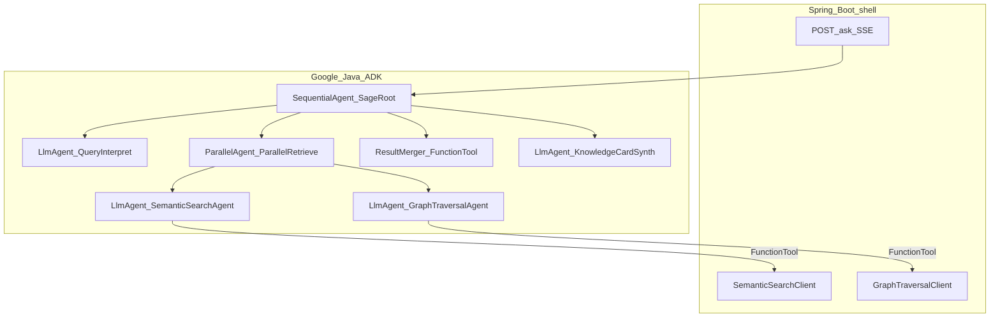
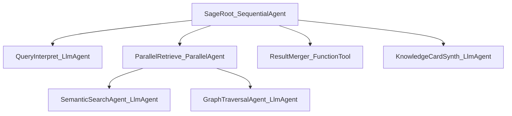
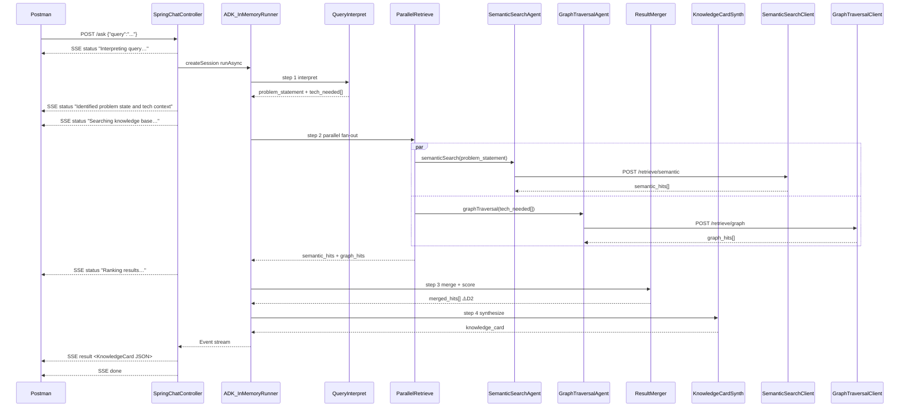

# Google Java ADK Usage

> **Status:** Pre-implementation guide — updated Jul 16 2026 (query interpretation, ParallelAgent, hybrid search)  
> **Architecture:** [architecture.md](architecture.md)  
> **Product scope:** [feature-document.md](feature-document.md)  
> **Orion reference (ingest only):** [orion-api-documentation.md](orion-api-documentation.md)  
> **Stack:** Java **21** (LTS) · Spring Boot **4.1** · Google ADK 1.5.0 · LangChain4j / Ollama  
> **Purpose:** How to use [Google ADK for Java](https://google.github.io/adk-docs/get-started/java/) for Sage's ask-time agent orchestration.

---

## ⚠️ Decisions Required Before Implementation

| # | Decision | Blocks | Owner |
|---|---|---|---|
| D1 | **Local LLM + hardware** — model name for `LangChain4jChatModel` config and embedding model | All `LlmAgent` instances, latency targets | Project lead |
| D2 | **Confidence score weights** — `w1` (vectorScore), `w2` (graphScore), boost for dual-match, min threshold | `ResultMerger` implementation | Tech lead |
| D3 | **Top-N** — default `top_k` sent to Python retrieval endpoints | `SemanticSearchTool` + `GraphTraversalTool` defaults | Project lead |

---

## 1. Purpose and scope

Sage answers: *who here already solved this, and where is the proof?* Google Java ADK owns the **ask pipeline** only.

| Layer | Owns | Does not own |
|-------|------|--------------|
| **Google Java ADK** | Query interpretation → parallel hybrid search fan-out → result merging → Knowledge Card synthesis; request-scoped session/events | Orion seed, Neo4j, PDF parsing, semantic search logic, graph traversal logic |
| **Spring Boot 4.1** | `POST /ask` HTTP/SSE, retrieval HTTP clients, SSE status events, eval entrypoint | Agent orchestration; Orion HTTP |
| **Python Retrieval Service** | Orion seed → Neo4j, `POST /retrieve/semantic`, `POST /retrieve/graph` | Ask orchestration, Knowledge Card |

### Design constraints

- **Shallow agent tree** — `SequentialAgent` wraps `ParallelAgent`; no `LoopAgent`, no LLM-driven router-of-routers.
- **`ParallelAgent` is used** for the semantic + graph search fan-out (learning goal: exercise ADK parallel orchestration).
- **Single-turn / request-scoped** sessions — no `MemoryService`.
- Local LLM via LangChain4j bridge (Ollama / OpenAI-compatible) *(⚠️ D1)*.
- Java **never** calls Orion API; ask-time evidence comes from Python retrieval service only.

---

## 2. Why Java does not call Orion at ask-time

Orion metadata is ingested once into Neo4j by the Python service. Ask-time uses `POST /retrieve`, which returns **card-complete** hits (teams, people, summary passage, document handle).

| Need | How it is met |
|------|----------------|
| Structured card fields | `/retrieve` `metadata` + `passage` |
| Technology vs hard-problem bias | Java `IntentClassify` → `intent` on `/retrieve` |
| Vague / multi-hop question | Graph traversal + vector search inside Graph RAG |
| Freshness | Bounded by last Orion ingest sync |
| Service down | Empty hits → honest `gapFlag` (no live Orion fallback) |

Full rationale: [architecture.md §6](architecture.md#6-orion-ingest-vs-ask-time).

---

## 3. ADK ownership boundary



**Pipeline:** `SageRoot` (`SequentialAgent`) → `QueryInterpret` → `ParallelRetrieve` → `ResultMerger` → `KnowledgeCardSynth`.

**Package home:** Agent and tool classes live under `com.company.sage.adk` (`agents/`, `tools/`, `SageAgents` factory); HTTP clients under `com.company.sage.clients.graphrag`. See [architecture.md §2](architecture.md#2-project-structure).

---

## 4. Agent architecture

### Agent tree



### Agent responsibility table

| Agent | ADK type | Tool(s) | Session key written |
|-------|----------|---------|-------------|
| `SageRoot` | `SequentialAgent` | — | — |
| `QueryInterpret` | `LlmAgent` | — | `problem_statement` (string), `tech_needed` (string[]) |
| `ParallelRetrieve` | `ParallelAgent` | — | — (aggregates children) |
| `SemanticSearchAgent` | `LlmAgent` | `semanticSearch(problemStatement, topK)` | `semantic_hits` |
| `GraphTraversalAgent` | `LlmAgent` | `graphTraversal(techNeeded, topK)` | `graph_hits` |
| `ResultMerger` | `FunctionTool` (Java, deterministic) | — | `merged_hits` (with `confidenceScore`) *(⚠️ D2)* |
| `KnowledgeCardSynth` | `LlmAgent` | — | `knowledge_card` |

### Knowledge Card field mapping

| Card field | Primary producer |
|------------|------------------|
| `problemStatement` | `QueryInterpret` |
| `techNeeded[]` | `QueryInterpret` |
| `directAnswer` | Match count + top hit title/team/experts (deterministic in ask path) |
| `results[].confidenceScore` | `ResultMerger` *(⚠️ D2)* |
| `results[].matchedVia` | `ResultMerger` |
| `results[].teamName` + `solvedBy` | Hit metadata from Python |
| `results[].summary` | Hit `passage` — extractive; do not paraphrase |
| `results[].documentLink` | Hit `metadata.documentLink` |
| `gapFlag` | `KnowledgeCardSynth` when `merged_hits` empty |

**Instruction stance:** Prefer tool evidence over generation. Never invent teams, people, or docs.

---

## 5. Orchestration

### Task routing

- `QueryInterpret` drives **what to search** (problem description + tech tags), not a router between HTTP sources.
- All evidence at ask-time comes from the Python retrieval service (two endpoints: semantic + graph).
- `ResultMerger` is deterministic Java — no LLM involved in scoring or deduplication.
- Synthesis interprets merged hit evidence to produce the Knowledge Card.

### Sequencing

1. Create request-scoped `Session`; emit `status: "Interpreting query…"` SSE event.
2. `QueryInterpret` writes `problem_statement` + `tech_needed[]` to session; emit `status: "Identified problem state and tech context"`.
3. Emit `status: "Searching knowledge base…"`.
4. `ParallelRetrieve` runs `SemanticSearchAgent` and `GraphTraversalAgent` concurrently.
   - `SemanticSearchAgent` calls `semanticSearch(problem_statement)` → writes `semantic_hits`.
   - `GraphTraversalAgent` calls `graphTraversal(tech_needed)` → writes `graph_hits`.
5. Emit `status: "Ranking results…"`.
6. `ResultMerger` reads `semantic_hits` + `graph_hits` → deduplicates, scores, sorts → writes `merged_hits`.
7. `KnowledgeCardSynth` reads session state → emits `knowledge_card` JSON.
8. Map ADK `Event`s to SSE `result` event + `done`.
9. Session discarded.

### State management

| Concern | Choice |
|---------|--------|
| Session store | `InMemorySessionService` via `InMemoryRunner` |
| Scope | One `Session` per ask; discard after response |
| Intermediate results | `problem_statement`, `tech_needed`, `semantic_hits`, `graph_hits`, `merged_hits` |
| Long-term memory | **Do not use** `MemoryService` |

---

## 6. ADK components

| Component | Role in Sage |
|-----------|--------------|
| `LlmAgent` | `QueryInterpret`, `SemanticSearchAgent`, `GraphTraversalAgent`, `KnowledgeCardSynth`; local model via LangChain4j *(⚠️ D1)* |
| `SequentialAgent` | `SageRoot` — interpret → parallel-retrieve → merge → synth |
| `ParallelAgent` | `ParallelRetrieve` — runs `SemanticSearchAgent` + `GraphTraversalAgent` concurrently |
| `FunctionTool` | `SemanticSearchTool` (wraps `SemanticSearchClient`), `GraphTraversalTool` (wraps `GraphTraversalClient`), `ResultMergerTool` (pure Java) |
| `InMemoryRunner` | Execute root agent from `SageAskService` |
| ADK `Event` stream | Bridge to Spring `SseEmitter` |

**Do not use:** `LoopAgent`, `MemoryService`, production ADK Web deployment.

### Maven (indicative)

```xml
<dependency>
   <groupId>com.google.adk</groupId>
   <artifactId>google-adk</artifactId>
   <version>1.5.0</version>
</dependency>
<dependency>
<groupId>com.google.adk</groupId>
<artifactId>google-adk-langchain4j</artifactId>
<version>1.5.0</version>
</dependency>
```

References: [Java quickstart](https://google.github.io/adk-docs/get-started/java/), [workflow agents](https://google.github.io/adk-docs/agents/workflow-agents/).

---

## 7. Integration sequence



---

## 8. Tool contracts

### `SemanticSearchTool.semanticSearch(problemStatement, topK)`

| | |
|---|---|
| **Endpoint** | `POST {SAGE_GRAPH_RAG_BASE_URL}/retrieve/semantic` |
| **Args** | `problemStatement` (string from `QueryInterpret`), `topK` (int, default *(⚠️ D3)*) |
| **Outbound body** | Includes `use_llm: false` — Sage owns LLM (Ollama/ADK); Graph RAG must not run its own LLM path |
| **Returns** | JSON `semantic_hits[]` per [architecture.md §12](architecture.md#12-inter-service-api-contracts) |
| **Fail-soft** | Return `"[]"` on any exception — never abort the ask; graph path still runs |

### `GraphTraversalTool.graphTraversal(techNeeded, topK)`

| | |
|---|---|
| **Endpoint** | `POST {SAGE_GRAPH_RAG_BASE_URL}/retrieve/graph` |
| **Args** | `techNeeded` (string[] from `QueryInterpret`), `topK` (int, default *(⚠️ D3)*) |
| **Returns** | JSON `graph_hits[]` per [architecture.md §12](architecture.md#12-inter-service-api-contracts) |
| **Fail-soft** | Return `"[]"` on any exception — semantic path still contributes |

### `ResultMergerTool.merge(toolContext)`

Pure Java — no LLM call. Reads `semantic_hits` / `graph_hits` from session state (written by the retrieve tools; do **not** use ADK `outputKey` for those keys or the agent's final text will overwrite structured hits). Deterministic merge logic:

1. Collect all hits from both lists.
2. Deduplicate by `doc_id` — if same `doc_id` in both: merge into one record with `matchedVia: ["semantic","graph"]`.
3. Calculate `confidenceScore` per hit: *(⚠️ D2 — exact formula TBD)*
   ```
   score = (w1 × vectorScore) + (w2 × graphScore) + dualMatchBoost
   ```
4. Filter out hits below `min_score` threshold *(⚠️ D2)*.
5. Sort descending by `confidenceScore`; take top-N *(⚠️ D3)*.
6. Write to session key `merged_hits` via `toolContext.state().put` (no `outputKey` on the merger agent).

`techNeeded[]` is produced by `QueryInterpret` **before** the parallel tool calls, then passed to `GraphTraversalTool`.

---

## 9. Agent factory (indicative)

```java
@Configuration
public class SageAgents {

   @Bean
   public SequentialAgent sageRootAgent(
           LangChain4jChatModel adkModel,        // ⚠️ D1 — model TBD
           SemanticSearchTool semanticTool,
           GraphTraversalTool graphTool,
           ResultMergerTool mergerTool) {

      // Step 1: interpret query into problem statement + tech tags
      LlmAgent queryInterpret = LlmAgent.builder()
              .name("QueryInterpret")
              .model(adkModel)
              .instruction("""
                      You are interpreting a developer's question about prior art in our organisation.
                      Extract exactly two things and output strict JSON:
                      {
                        "problemStatement": "<one sentence: what problem is being solved>",
                        "techNeeded": ["<technology or pattern 1>", "..."]
                      }
                      Do not add explanation. Output only the JSON object.
                      """)
              .outputKey("query_interpretation")
              .build();

      // Step 2a: semantic search agent
      LlmAgent semanticSearch = LlmAgent.builder()
              .name("SemanticSearchAgent")
              .model(adkModel)
              .tools(List.of(FunctionTool.create(semanticTool, "semanticSearch")))
              .instruction("""
                      Call semanticSearch with the problemStatement from query_interpretation.
                      Report only tool results. Never invent teams, people, or documents.
                      """)
              // structured hits written by SemanticSearchTool into session state
              .build();

      // Step 2b: graph traversal agent
      LlmAgent graphTraversal = LlmAgent.builder()
              .name("GraphTraversalAgent")
              .model(adkModel)
              .tools(List.of(FunctionTool.create(graphTool, "graphTraversal")))
              .instruction("""
                      Call graphTraversal with the techNeeded array from query_interpretation.
                      Report only tool results. Never invent teams, people, or documents.
                      """)
              .build();

      // Step 2: parallel fan-out
      ParallelAgent parallelRetrieve = new ParallelAgent(
              "ParallelRetrieve",
              List.of(semanticSearch, graphTraversal)
      );

      // Step 3: deterministic merge + confidence scoring (no LLM)
      // ⚠️ D2 — weights and threshold configured externally
      LlmAgent merger = LlmAgent.builder()
              .name("ResultMerger")
              .model(adkModel)
              .tools(List.of(FunctionTool.create(mergerTool, "merge")))
              .instruction("Call merge with no arguments. It reads semantic_hits and graph_hits from session state and writes merged_hits.")
              .build();

      // Step 4: Knowledge Card synthesis
      LlmAgent synth = LlmAgent.builder()
              .name("KnowledgeCardSynth")
              .model(adkModel)
              .instruction(SYNTH_INSTRUCTION)
              .outputKey("knowledge_card")
              .build();

      return new SequentialAgent(
              "SageRoot",
              List.of(queryInterpret, parallelRetrieve, merger, synth)
      );
   }
}
```

### `QueryInterpret` instruction

```
You are interpreting a developer's question about prior art in our organisation.
Extract exactly two things and output strict JSON:
{
  "problemStatement": "<one sentence: what problem is being solved in organisational context>",
  "techNeeded": ["<technology or pattern>", "..."]
}
Do not add explanation. Output only the JSON object.
```

### `KnowledgeCardSynth` instruction

```
Assemble a Knowledge Card from merged_hits and query_interpretation.
- query: echo the original user question
- problemStatement / techNeeded: from query_interpretation
- directAnswer: N match(es). Top: '{title}' owned by team '{team}'. Experts: … (or gap string if empty; never copy summary)
- results[]: from merged_hits — map all fields directly; do NOT paraphrase summary/passage
- gapFlag: true if merged_hits is empty
- gapMessage: "No internal prior art found — this may be a candidate Hard Problem" when gapFlag=true
- Never invent teams, people, or documents
- Emit strict JSON matching the Knowledge Card schema in architecture.md §11
```

---

## 10. Configuration

```yaml
sage:
   graph-rag:
      base-url: http://localhost:8000   # SAGE_GRAPH_RAG_BASE_URL
   adk:
      llm:
         base-url: http://localhost:11434   # ⚠️ D1 — validate model + hardware
         model-name: llama3.2:3b            # ⚠️ D1 — TBD
   retrieval:
      top-k: 5              # ⚠️ D3 — confirm
      min-score: 0.60       # ⚠️ D2 — TBD
   scoring:
      w1: 0.6               # ⚠️ D2 — vector similarity weight TBD
      w2: 0.4               # ⚠️ D2 — graph score weight TBD
      dual-match-boost: 0.1 # ⚠️ D2 — boost for results matched by both paths TBD
```

| Variable | Default | Description |
|----------|---------|-------------|
| `SAGE_GRAPH_RAG_BASE_URL` | `http://localhost:8000` | Graph RAG retrieval service base URL |
| `OLLAMA_BASE_URL` | `http://localhost:11434` | Local LLM for ADK *(⚠️ D1)* |
| `SAGE_RETRIEVAL_TOP_K` | `5` | Top-N results *(⚠️ D3)* |
| `SAGE_SCORING_W1` | `0.6` | Vector similarity weight *(⚠️ D2)* |
| `SAGE_SCORING_W2` | `0.4` | Graph score weight *(⚠️ D2)* |
| `SAGE_SCORING_DUAL_BOOST` | `0.1` | Dual-match confidence boost *(⚠️ D2)* |
| `SAGE_SCORING_MIN_SCORE` | `0.60` | Minimum threshold — suppress below *(⚠️ D2)* |

Java does **not** configure Orion credentials. Orion env vars belong to the Python seed script only.

---

## 11. Testing

| Test | Assertion |
|------|-----------|
| `QueryInterpretTest` | LLM extracts correct `problemStatement` and `techNeeded[]` from sample queries |
| `SemanticSearchFallbackTest` | `semantic_hits = "[]"` when Python `/retrieve/semantic` is down; graph path still runs |
| `GraphTraversalFallbackTest` | `graph_hits = "[]"` when Python `/retrieve/graph` is down; semantic path still contributes |
| `ResultMergerTest` | Duplicate `doc_id` across both paths → merged into one result; confidence score calculated |
| `GapFlagTest` | `gapFlag=true` when `merged_hits` empty (both paths returned `[]`) |
| `SseStreamTest` | All 6 SSE events emitted in correct order: 4× `status`, 1× `result`, 1× `done` |
| `ChatControllerE2ETest` | Full pipeline against Python stub; Knowledge Card JSON matches §11 contract |

Eval uses the same `POST /ask` path as Postman — no special harness.

---

## 12. Trade-offs

| Choice | Benefit | Cost |
|--------|---------|------|
| `QueryInterpret` LLM step | Catches vocabulary mismatch; surfaces interpretation to user | Extra LLM call adds latency *(⚠️ D1 — validate)* |
| `ParallelAgent` fan-out | Exercises ADK parallel orchestration (learning goal); both search paths run simultaneously | Slightly more complex agent tree to debug |
| `ResultMerger` as deterministic Java | Predictable, fast, no hallucination in scoring | Confidence weights must be tuned manually *(⚠️ D2)* |
| Two Python endpoints (`/semantic` + `/graph`) | Clear separation; each optimised for its query type | More Python surface to implement and test |
| Extractive `passage` over paraphrase | Credible, non-hallucinated summaries | Less fluent prose |
| No `MemoryService` | Simple, reliable, single-turn | No conversational follow-up |
| Postman-only client for POC | Eliminates web UI build from 2-week timeline | Demo must be scripted in Postman; no live-typeable UI |
