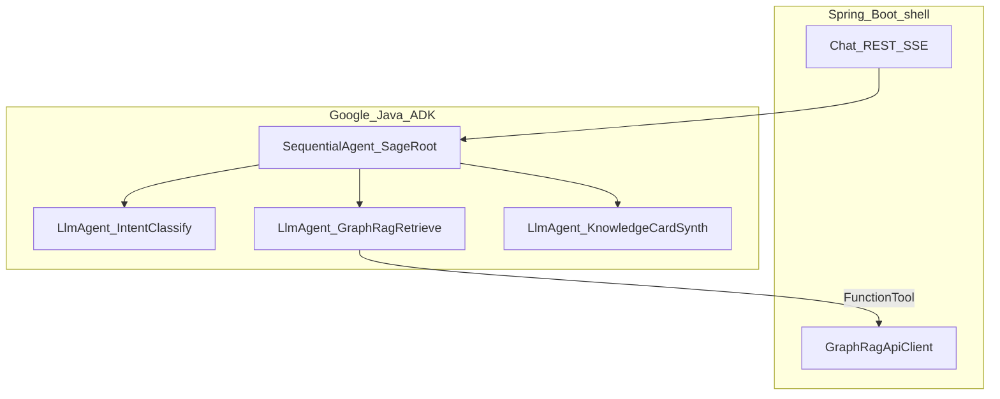
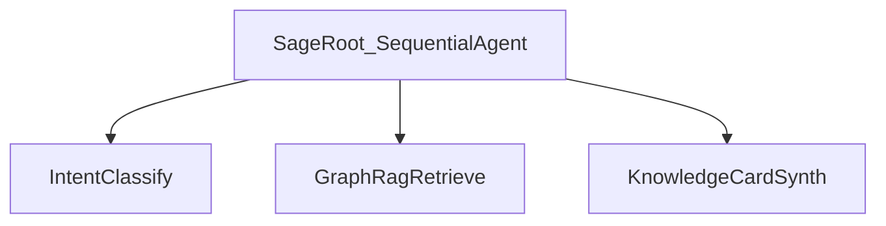
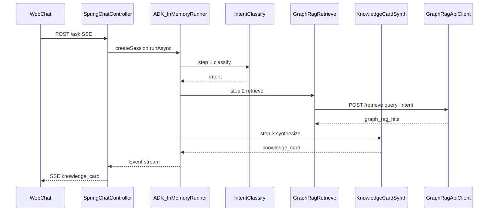

# Google Java ADK Usage

> **Status:** Pre-implementation guide  
> **Architecture:** [architecture.md](architecture.md)  
> **Product scope:** [feature-document.md](../feature-document.md)  
> **Orion reference (ingest only):** [orion-api-documentation.md](orion-api-documentation.md)  
> **Stack:** Java **25** (LTS) · Spring Boot **4.1** · Google ADK 1.5.0 · LangChain4j / Ollama  
> **Purpose:** How to use [Google ADK for Java](https://google.github.io/adk-docs/get-started/java/) for Sage's ask-time agent orchestration.

---

## 1. Purpose and scope

Sage answers: *who here already solved this, and where is the proof?* Google Java ADK owns the **ask pipeline** only.

| Layer | Owns | Does not own |
|-------|------|--------------|
| **Google Java ADK** | Question → intent classify → Graph RAG retrieve → Knowledge Card synthesis; request-scoped session/events | Orion-metadata ingest, Neo4j, PDF parsing, REST/SSE transport |
| **Spring Boot 4.1** | Chat HTTP/SSE, Graph RAG HTTP client, web UI, eval entrypoint | Agent orchestration logic; Orion HTTP |
| **Graph RAG Python** | Orion-metadata sync → Neo4j, `POST /retrieve` | Ask orchestration |

### Design constraints

- Shallow agent tree — no `LoopAgent`, no LLM-driven router-of-routers across external sources.
- **Single-turn / request-scoped** sessions — no `MemoryService`.
- Local LLM via LangChain4j bridge (Ollama / OpenAI-compatible).
- Java **never** calls Orion; ask-time evidence comes only from Graph RAG.

---

## 2. Why Java does not call Orion at ask-time

Orion metadata is ingested once into Neo4j by the Python service. Ask-time uses `POST /retrieve`, which returns **card-complete** hits (teams, people, summary passage, document handle).

| Need | How it is met |
|------|----------------|
| Structured card fields | `/retrieve` `metadata` + `passage` |
| Technology vs hard-problem bias | Java `IntentClassify` → `intent` on `/retrieve` |
| Vague / multi-hop question | Graph traversal + vector search inside Graph RAG |
| Freshness | Bounded by last Orion ingest sync |
| Service down | Empty hits → honest `gapFlag` (no live Orion fallback) |

Full rationale: [architecture.md §6](architecture.md#6-orion-ingest-vs-ask-time).

---

## 3. ADK ownership boundary



**Pipeline:** `SageRoot` (`SequentialAgent`) → `IntentClassify` → `GraphRagRetrieve` → `KnowledgeCardSynth`.

---

## 4. Agent architecture

### Agent tree



### Agent responsibility table

| Agent | ADK type | Tool(s) | Session key |
|-------|----------|---------|-------------|
| `SageRoot` | `SequentialAgent` | — | — |
| `IntentClassify` | `LlmAgent` | — | `intent` (`technology` \| `problem` \| `ambiguous`) |
| `GraphRagRetrieve` | `LlmAgent` | `retrieveFromGraph(query, intent)` | `graph_rag_hits` |
| `KnowledgeCardSynth` | `LlmAgent` | — | `knowledge_card` |

### Knowledge Card field mapping

| Card field | Primary producer |
|------------|------------------|
| Direct answer | `KnowledgeCardSynth` (from hit titles + counts) |
| Team(s) + people | `GraphRagRetrieve` → `metadata.teams`, `metadata.people` |
| Evidence / confidence | Hit count + score bands ([architecture.md §11](architecture.md#11-knowledge-card-contract)) |
| Summary | **`hits[].passage`** (extractive; do not paraphrase) |
| Full document | `metadata.fileName` / `ticketLink` |
| Honesty / gap flag | `KnowledgeCardSynth` when `graph_rag_hits` empty |
| Intent (audit) | `IntentClassify` → echoed on card |

**Instruction stance:** Prefer tool evidence over generation. Never invent teams, people, or docs.

---

## 5. Orchestration

### Task routing

- Intent classification chooses **retrieval bias**, not which external HTTP source to call.
- There is a single evidence source at ask-time: Graph RAG.
- Synthesis interprets hit evidence — product routing (which team/doc), not multi-source fan-out.

### Sequencing

1. Create request-scoped `Session`.
2. `IntentClassify` writes `intent` (`technology` | `problem` | `ambiguous`).
3. `GraphRagRetrieve` calls `retrieveFromGraph` with the user question and intent.
4. `KnowledgeCardSynth` reads session state and emits Knowledge Card JSON.
5. Map ADK `Event`s to SSE (`knowledge_card` event).

### State management

| Concern | Choice |
|---------|--------|
| Session store | `InMemorySessionService` via `InMemoryRunner` |
| Scope | One `Session` per ask; discard after response |
| Intermediate results | `intent`, `graph_rag_hits` |
| Long-term memory | **Do not use** `MemoryService` |

---

## 6. ADK components

| Component | Role in Sage |
|-----------|--------------|
| `LlmAgent` | Intent, retrieve, synthesizer; local model via LangChain4j |
| `SequentialAgent` | `SageRoot` — intent → retrieve → synth |
| `FunctionTool` | Thin wrapper over `GraphRagApiClient` |
| `InMemoryRunner` | Execute root agent from `SageAskService` |
| ADK `Event` stream | Bridge to SSE |

**Do not use:** `LoopAgent`, `MemoryService`, `ParallelAgent` for multi-source Orion fan-out, production ADK Web deployment.

### Maven (indicative)

```xml
<dependency>
  <groupId>com.google.adk</groupId>
  <artifactId>google-adk</artifactId>
  <version>1.5.0</version>
</dependency>
<dependency>
  <groupId>com.google.adk</groupId>
  <artifactId>google-adk-langchain4j</artifactId>
  <version>1.5.0</version>
</dependency>
```

References: [Java quickstart](https://google.github.io/adk-docs/get-started/java/), [workflow agents](https://google.github.io/adk-docs/agents/workflow-agents/).

---

## 7. Integration sequence



---

## 8. Tool contracts

### `GraphRagRetrievalTool.retrieveFromGraph(query, intent)`

| | |
|---|---|
| **Endpoint** | `POST {SAGE_GRAPH_RAG_BASE_URL}/retrieve` |
| **Args** | `query` (user question), `intent` (`technology` \| `problem` \| `ambiguous`) |
| **Returns** | JSON hits per [architecture.md §12](architecture.md#12-inter-service-api-contracts) |

Fail-soft: return `"[]"` on any exception — never abort the ask.

Intent is produced by `IntentClassify` **before** the retrieve tool call, then passed into `retrieveFromGraph`.

---

## 9. Agent factory (indicative)

```java
@Configuration
public class SageAgents {

    @Bean
    public SequentialAgent sageRootAgent(
            LangChain4jChatModel adkModel,
            GraphRagRetrievalTool graphRagTool) {

        LlmAgent intentClassify = LlmAgent.builder()
            .name("IntentClassify")
            .model(adkModel)
            .instruction("""
                Classify the user question as exactly one of:
                technology | problem | ambiguous.
                technology = asking about a stack, library, platform, or tool usage.
                problem = asking about a hard problem, failure mode, or how something was solved.
                ambiguous = unclear or mixes both.
                Output only the intent token.
                """)
            .outputKey("intent")
            .build();

        LlmAgent graphRagRetrieve = LlmAgent.builder()
            .name("GraphRagRetrieve")
            .model(adkModel)
            .tools(List.of(FunctionTool.create(graphRagTool, "retrieveFromGraph")))
            .instruction("""
                Call retrieveFromGraph with the user question and the classified intent.
                Report only tool results. Never invent teams, people, or documents.
                """)
            .outputKey("graph_rag_hits")
            .build();

        LlmAgent synth = LlmAgent.builder()
            .name("KnowledgeCardSynth")
            .model(adkModel)
            .instruction(SYNTH_INSTRUCTION)
            .outputKey("knowledge_card")
            .build();

        return new SequentialAgent("SageRoot", List.of(intentClassify, graphRagRetrieve, synth));
    }
}
```

### `KnowledgeCardSynth` instruction

```
Merge graph_rag_hits (and intent) into a Knowledge Card.
- Prefer hits[].passage as summary — do not paraphrase when present
- Map metadata.teams / metadata.people / fileName / ticketLink into card fields
- evidenceConfidence per architecture score bands (HIGH / MEDIUM / LOW / NONE)
- If hits empty: gapFlag=true
- Never invent teams, people, or documents
- Emit strict JSON
```

---

## 10. Configuration

```yaml
sage:
  graph-rag:
    base-url: http://localhost:8000
  adk:
    llm:
      base-url: http://localhost:11434
      model-name: llama3.2:3b
```

| Variable | Default | Description |
|----------|---------|-------------|
| `SAGE_GRAPH_RAG_BASE_URL` | `http://localhost:8000` | Graph RAG client |
| `OLLAMA_BASE_URL` | `http://localhost:11434` | Local LLM for ADK |

Java does **not** configure Orion credentials. Orion env vars belong to the Python ingest service only.

---

## 11. Testing

| Test | Assertion |
|------|-----------|
| `IntentClassifyTest` | Technology-flavored question → `intent=technology` |
| `GraphRagRetrieveFallbackTest` | `graph_rag_hits = "[]"` when Python down |
| `GapFlagTest` | `gapFlag=true` when hits empty |
| `ChatControllerE2ETest` | SSE `knowledge_card` event; retrieve called with intent |

Eval uses the same `POST /ask` path as the UI — no special harness.

---

## 12. Trade-offs

| Choice | Benefit | Cost |
|--------|---------|------|
| Intent then single `/retrieve` | Clear Java↔Python contract; no dual Orion clients | Card quality depends on ingest freshness and retrieve projection |
| Card-complete retrieve metadata | Java needs no Orion HTTP | Graph RAG API must stay rich enough for Knowledge Card |
| Extractive `passage` over paraphrase | Credible answers | Less fluent prose |
| No `MemoryService` | Simple, reliable | No conversational follow-up |
