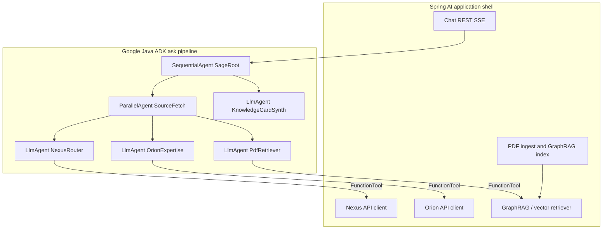
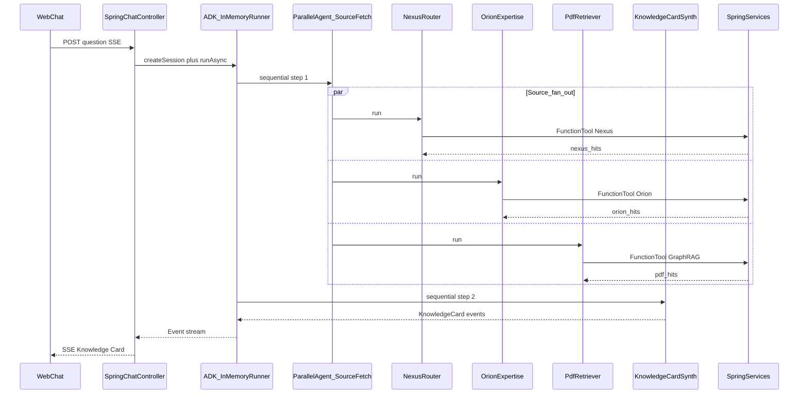

# Google Java ADK Usage — Sage POC

> **Status:** Pre-implementation architecture guide  
> **Source of truth for product scope:** [feature-document.md](../feature-document.md)  
> **Purpose:** How to use [Google ADK for Java](https://google.github.io/adk-docs/get-started/java/) for Sage’s ask-time agent orchestration — concise and implementation-focused.

---

## 1. Purpose and scope

Sage answers: *who here already solved this, and where is the proof?* Google Java ADK owns the **ask pipeline** only.

| Layer | Owns | Does not own |
|-------|------|--------------|
| **Google Java ADK** | Question → parallel source fetch → Knowledge Card synthesis; request-scoped session/events | PDF ingest, embeddings, GraphRAG index build, REST/SSE transport, Nexus/Orion HTTP clients |
| **Spring AI (+ Spring Boot)** | Ingestion, local embeddings, GraphRAG/vector retrieval, API clients, chat HTTP/SSE | Agent orchestration logic |

**POC limits (explicit):**

- Shallow agent tree — no deep multi-turn reasoning, no `LoopAgent`, no LLM-driven router-of-routers.
- **Single-turn / request-scoped** sessions only — no cross-turn `MemoryService`.
- Local LLM via LangChain4j bridge (OpenAI-compatible / Ollama) — Phase-0 spike before wiring agents.
- Demo-grade, not production HA/auth/RBAC.

---

## 2. Proposed agent architecture

Deterministic workflow agents control flow; `LlmAgent`s call tools and summarize. Route-first: tools return evidence; synthesis only summarizes and names teams/people.



**Pipeline shape:** `SageRoot` (`SequentialAgent`) runs `SourceFetch` (`ParallelAgent`) then `KnowledgeCardSynth` (`LlmAgent`).

---

## 3. Required agents and responsibilities

| Agent | ADK type | Responsibility | Features |
|-------|----------|----------------|----------|
| `SageRoot` | `SequentialAgent` | Fixed order: parallel fetch → synthesize card | F1 |
| `SourceFetch` | `ParallelAgent` | Fan-out Nexus + Orion + PDF retrieval concurrently | F2 |
| `NexusRouter` | `LlmAgent` + tools | Team ↔ tech coverage, hard-problem counts | F2, F3 |
| `OrionExpertise` | `LlmAgent` + tools | People, solved counts, Orion summaries | F2, F3, F4 |
| `PdfRetriever` | `LlmAgent` + tools | Call Spring GraphRAG/retriever; passages + doc handles | F2, F4 |
| `KnowledgeCardSynth` | `LlmAgent` | Merge hits into Knowledge Card; gap flag when empty | F1, F5 |

### Knowledge Card field mapping

| Card field | Primary producer |
|------------|------------------|
| Direct answer | `KnowledgeCardSynth` (from hits) |
| Team(s) + people | `NexusRouter` + `OrionExpertise` |
| Evidence / confidence | Nexus/Orion counts via tools |
| Summary | Orion summary and/or PDF passages (extractive) |
| Full document | `PdfRetriever` (link/handle) or “no formal doc yet” |
| Honesty / gap flag | `KnowledgeCardSynth` when all sources empty/irrelevant |

**Instructions stance for all LLM agents:** Prefer tool evidence over generation. Never invent teams, people, or docs. If nothing relevant, say so.

---

## 4. Orchestration and workflows

### Task routing

- **Not** an LLM that chooses which source to call.
- Always run all three source agents in parallel; each tool decides relevance (empty list = no hit).
- Synthesis interprets combined evidence — this is “routing” in the product sense (which team/doc), not control-flow routing.

### Sequencing

1. Create request-scoped `Session`.
2. `SourceFetch` completes (all three branches).
3. `KnowledgeCardSynth` reads session state / prior events and emits the card.
4. Map final (and optionally intermediate) ADK `Event`s to SSE.

### Parallelism

- `ParallelAgent` runs `NexusRouter`, `OrionExpertise`, `PdfRetriever` concurrently to cut P95 latency.
- Tools must be thread-safe (stateless Spring beans or request-scoped clients).
- Partial failure: one source error → empty hits for that source + synth still runs (honest partial card).

### State management

| Concern | POC choice |
|---------|------------|
| Session store | `InMemorySessionService` via `InMemoryRunner` |
| Scope | One `Session` per ask; discard after response |
| Intermediate results | Session state keys, e.g. `nexus_hits`, `orion_hits`, `pdf_hits` (structured JSON/maps from tools) |
| Long-term memory | **Do not use** `MemoryService` / `LoadMemoryTool` |
| Artifacts | Optional: PDF handle as artifact if useful for Dev UI; not required for chat |

---

## 5. ADK components to use

| Component | Role in Sage |
|-----------|--------------|
| `LlmAgent` | Source agents + synthesizer; local model via LangChain4j |
| `SequentialAgent` | `SageRoot` — fetch then synth |
| `ParallelAgent` | `SourceFetch` — concurrent sources |
| `FunctionTool` | Thin wrappers over Spring beans (Nexus, Orion, retriever) |
| `InMemoryRunner` / `Runner` | Execute root agent from Spring service |
| `RunConfig` | Per-run options (streaming-friendly defaults) |
| `Session` + `InMemorySessionService` | Request-scoped conversation/state |
| ADK `Event` stream (`Flowable`) | Bridge to SSE for F6 |
| `google-adk-langchain4j` + OpenAI/Ollama chat model | Local LLM (privacy; IP stays on-network) |
| `google-adk-dev` / `AdkWebServer` | Local agent debugging only — not the product UI |

**Do not use for POC:** `LoopAgent`, `MemoryService`, Vertex/Firestore session/memory backends, production ADK Web deployment.

### Maven (indicative)

```xml
<dependency>
  <groupId>com.google.adk</groupId>
  <artifactId>google-adk</artifactId>
  <version>1.5.0</version>
</dependency>
<dependency>
  <groupId>com.google.adk</groupId>
  <artifactId>google-adk-langchain4j</artifactId>
  <!-- align version with google-adk -->
</dependency>
<!-- plus langchain4j-open-ai or langchain4j-ollama for the local endpoint -->
```

Pin exact versions at kickoff; bump only after the Phase-0 model spike.

### Local model wiring (pattern)

1. Build LangChain4j `OpenAiChatModel` / `OllamaChatModel` pointing at the local endpoint.
2. Wrap with ADK `LangChain4j` (`BaseLlm`).
3. Pass into every `LlmAgent.builder().model(...)`.

References: [Java quickstart](https://google.github.io/adk-docs/get-started/java/), [workflow agents](https://google.github.io/adk-docs/agents/workflow-agents/), [LangChain4j bridge](https://developers.googleblog.com/adk-for-java-opening-up-to-third-party-language-models-via-langchain4j-integration/).

---

## 6. Integration with the application



### Boundaries

| Spring component | ADK interaction |
|------------------|-----------------|
| Chat controller / service | Creates session, calls `runner.runAsync(...)`, maps `Event` → SSE |
| `NexusClient`, `OrionClient` | Invoked only via `FunctionTool` from source agents |
| GraphRAG / vector retriever | Invoked only via `PdfRetriever` tools; index built by ingest jobs **outside** ADK |
| Ingest pipeline (F7) | No ADK agents — Spring AI embeddings + GraphRAG write path |
| Promptfoo / MLflow (F8) | Call the same chat/ask entrypoint; score Knowledge Card fields |

### Tool contract guidelines

- Tools return **typed, citation-ready** payloads (team id/name, person, counts, doc id/url, short passage).
- Prefer empty collections over null; synth treats empty as “no evidence.”
- Keep tool methods side-effect free (read-only APIs for the ask path).

### Streaming (F6)

- Stream ADK events as they arrive (tool progress optional; final card required).
- Product UI is the Spring web chat — not ADK Dev UI.

---

## 7. Assumptions, trade-offs, and recommendations

### Assumptions

1. Local LLM is reachable via OpenAI-compatible or Ollama API and works with ADK tool calling through LangChain4j (validate in Phase-0).
2. Nexus and Orion APIs plus 10–30 curated PDFs are available at kickoff.
3. Route-first + extractive summaries keep hallucination risk low enough for a CEO demo.
4. One ask ≈ one Knowledge Card; follow-ups are new asks (no conversational memory).

### Trade-offs

| Choice | Benefit | Cost |
|--------|---------|------|
| Deterministic `ParallelAgent` + always-all-sources | Predictable latency and eval; simple | Extra API/retrieval cost when one source would suffice |
| ADK for ask + Spring AI for ingest/HTTP | Clear learning map (§12 of feature doc); testable tools | Two frameworks to wire and debug |
| No `MemoryService` | Fits non-goals; reliable demos | No “who on that team?” follow-up without re-asking |
| Shallow tree (no `LoopAgent`) | Fits 2-week POC | No iterative refine loops |

### Implementation recommendations

1. **Phase-0 spike first:** One `LlmAgent` + one `FunctionTool` against the local model; confirm tool calling and streaming before building the full graph.
2. **Keep tools thin:** Business logic and HTTP live in Spring services; ADK tools are adapters.
3. **Shared card schema:** Define a Java record/DTO for the Knowledge Card; synth must emit it; Promptfoo asserts fields.
4. **Fail soft per source:** Catch tool errors, write empty hits + error note to state, continue synth.
5. **Debug with ADK Dev UI; ship with Spring chat.** Do not expose Dev UI in demo environments.
6. **Eval early:** Golden set (§5 / F8) against the same runner path used by the UI.

---

## 8. Suggested package layout (when coding starts)

```
.../sage/
  chat/          # Spring REST + SSE
  ingest/        # PDF + GraphRAG write path
  clients/       # Nexus, Orion
  retrieval/     # GraphRAG / vector query API
  adk/
    SageAgents.java      # ROOT_AGENT = SequentialAgent(...)
    tools/               # FunctionTool adapters
    SageAskService.java  # Runner + session + event bridge
```

Root agent construction should be a single factory used by both the chat path and eval harness.
