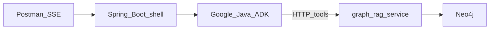

# Spec coverage map — Spring, Google ADK, Graph RAG

> **Purpose:** Checklist of what **future tech specs must cover** per technology topic.  
> **Not a replacement for:** [feature-document.md](feature-document.md), [architecture.md](architecture.md), or [google-java-adk-usage.md](google-java-adk-usage.md).  
> **Rule of thumb:** *Spring hosts and transports; ADK reasons and orchestrates agents; Graph RAG retrieves.*

---

## 1. System fit

| Layer             | Repo                | Owns                                                                            | Does not own                           |
| ----------------- | ------------------- | ------------------------------------------------------------------------------- | -------------------------------------- |
| Spring Boot shell | `sage-ai`           | Public HTTP/SSE, config, DI, retrieve clients, health, deterministic merge host | Agent tree, Neo4j, Orion               |
| Google Java ADK   | `sage-ai`           | Ask pipeline agents, tools, session/events, Knowledge Card synthesis            | Retrieval algorithms, schema, ingest   |
| Graph RAG         | `graph-rag-service` | Neo4j, embeddings, Orion/PDF ingest, `/retrieve/*`                              | Ask orchestration, SSE, Knowledge Card |

Java never hits Neo4j or Orion at ask-time. Python never builds the Knowledge Card.

---

## 2. Spec coverage checklists

### 2.1 Spring Boot shell

Specs for this topic must cover:

- [ ] `POST /ask` request/response and SSE event contract (`status` / `result` / `done`) — see [contracts/ask-api.md](contracts/ask-api.md)
- [ ] `GET /health` (including Graph RAG reachability)
- [ ] Config / env (`SAGE_GRAPH_RAG_BASE_URL`, `OLLAMA_BASE_URL`, timeouts, top-k defaults)
- [ ] HTTP clients for `/retrieve/semantic` and `/retrieve/graph`
- [ ] Fail-soft when Graph RAG is down or returns empty (no live Orion fallback)
- [ ] `correlationId` generation and propagation to Graph RAG calls/logs
- [ ] ADK runner ↔ Spring lifecycle; ADK `Event` stream → `SseEmitter`
- [ ] Host for deterministic merge + confidence scoring (non-LLM Java)
- [ ] POC non-goals called out (no SSO/RBAC) without inventing production security work

**Out of Spring specs:** Orion ingest, Cypher, embeddings, Neo4j schema, agent prompt/tree design.

### 2.2 Google ADK

Specs for this topic must cover:

- [ ] Ownership: ADK owns **ask pipeline only**; tools call Spring HTTP clients, not Neo4j
- [ ] Shallow agent tree: `SequentialAgent` → Interpret → `ParallelAgent` (semantic + graph) → merge → Knowledge Card synth
- [ ] Per-agent inputs/outputs and session keys (`problemStatement`, `techNeeded`, hits, card JSON)
- [ ] FunctionTools for retrieve endpoints only (`/retrieve/semantic`, `/retrieve/graph`)
- [ ] Local LLM via LangChain4j → Ollama (decision D1); no production Gemini assumption for POC
- [ ] Request-scoped sessions — no `MemoryService`, no `LoopAgent`
- [ ] Fail-soft / honest gap when hits are empty
- [ ] Intentional use of `ParallelAgent` (learning goal: parallel orchestration)
- [ ] How agents are stubbed/tested without a live Graph RAG — see [google-java-adk-usage.md](google-java-adk-usage.md)

**Out of ADK specs:** Schema design, vector index tuning, Orion seed details, public HTTP contract field shapes (consume retrieve contract as fixed).

### 2.3 Graph RAG

Specs for this topic must cover:

- [ ] F0 ingest: Orion endpoints + PDF path; idempotent seed; node/edge outcomes
- [ ] Neo4j schema: `Technology` / `HardProblem` / `Team` / `Person` / `Document` + relationships — see sister [GraphRAG_Schema_Data_Ingestion.md](../../graph-rag-service/GraphRAG_Schema_Data_Ingestion.md)
- [ ] Embeddings: which fields, which model, Neo4j vector index
- [ ] Fixed retrieve contracts consumed by Java:
  - `POST /retrieve/semantic` — `problemStatement` → vector hits
  - `POST /retrieve/graph` — `techNeeded[]` → traversal hits
- [ ] Card-complete response fields (team, person, passage, doc handle, scores) so Java never calls Orion
- [ ] Health / reseed operational endpoints for POC
- [ ] Failure modes: Neo4j down → `500`; empty index → `200` + `hits: []`
- [ ] Contract SoT: `api_contracts.py` + [contracts/retrieve-api.md](contracts/retrieve-api.md) stay aligned

**Out of Graph RAG specs:** Knowledge Card LLM prompts, SSE streaming UX, ADK agent tree.

---

## 3. Ownership decision (POC)

**Spring hosts and transports; ADK reasons and orchestrates agents; Graph RAG retrieves.**

### Where they fight

Spring AI (`ChatClient`, tool calling, advisors, streaming) and Google ADK both cover the same ask-path jobs. If both own them, specs and code diverge.

| Responsibility | If Spring AI | If Google ADK |
| --- | --- | --- |
| Query interpretation | `ChatClient` / advisors | `LlmAgent` QueryInterpret |
| Parallel retrieve orchestration | Spring `@Async` / custom fan-out | `ParallelAgent` |
| Tool calls to retrieve APIs | Spring AI tool calling | ADK FunctionTools |
| Knowledge Card synthesis | Spring AI prompt + stream | `LlmAgent` KnowledgeCardSynth |
| Streaming answer path | Spring AI token stream | ADK `Event` stream → Spring SSE |

Doing both means duplicate agent trees, two prompt homes, and unclear fail-soft.

### Locked for POC

- **Spring Boot** — `POST /ask` SSE, config/DI, Graph RAG HTTP clients, health, host for deterministic merge/scoring. Not the agent tree.
- **Google ADK** — query interpret → parallel retrieve agents → merge tool → Knowledge Card synth; sessions and event stream. LLM access via LangChain4j → Ollama only.
- **Graph RAG (Python)** — Neo4j, embeddings, Orion/PDF ingest, `/retrieve/*`. Not ask orchestration or the Knowledge Card.
- **Spring AI** — out of the ask path. Do not add `spring-ai-*` to `pom.xml` for interpretation, tools, orchestration, or card synthesis.

Detail: [architecture.md](architecture.md), [google-java-adk-usage.md](google-java-adk-usage.md).