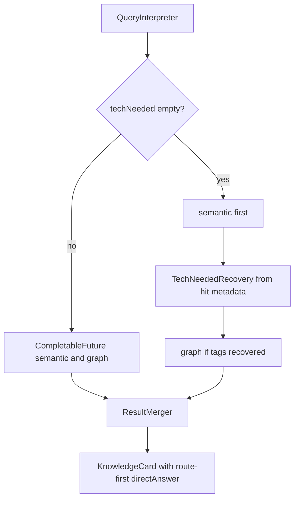

# Plan: Ask low-cost correctness

**Spec:** [docs/specs/ask-low-cost-correctness.md](../docs/specs/ask-low-cost-correctness.md)  
**Goal:** Highest answer-correctness impact with least code. Implement in cost order (tiny → small).

## Approach

Keep live orchestrator as Spring `SageAskService` (do not wire ADK). Three surgical edits this pass (T1, T2, T4). **T3 (degraded ≠ gap) is deferred** — cover later.

## Risks

| Risk | Mitigation |
|------|------------|
| Parallel retrieve + empty-tag recovery conflict | Branch: parallel only when tags non-empty; else sequential recover |
| `CompletableFuture` default pool | Acceptable for POC; same as typical Spring service fan-out |
| False Hard Problem on Graph RAG 5xx | Deferred with T3; leave current fail-soft / gap behavior until then |

## Verification checkpoints

After each task: run the listed `./mvnw test -Dtest=...` then continue.
