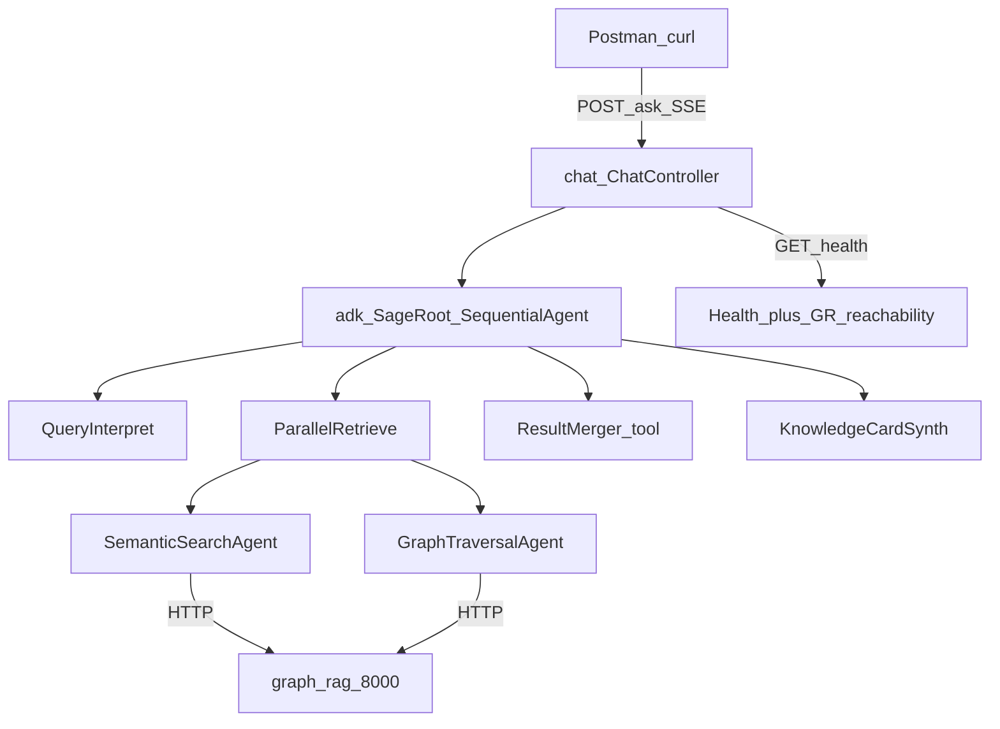
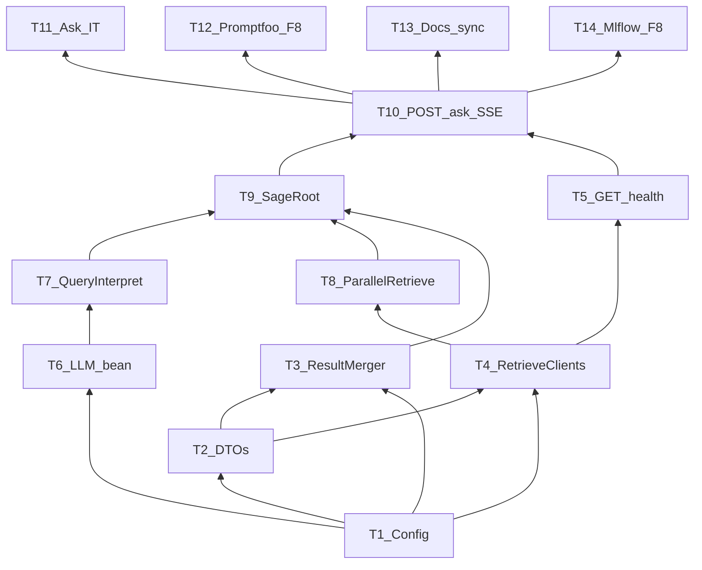

# Implementation Plan: Sage AI Ask Pipeline (Java POC)

## Overview

`[docs/SPEC.md](../docs/SPEC.md)` is **approved**. This repo is a Spring Boot shell with empty packages — no controllers, clients, merge, or ADK agents yet. Build F1–F6 + F8 in vertical slices that leave the system testable after each phase. F0/F7 stay in `graph-rag-service`.

**Do not implement application code until this plan and** `[todo.md](todo.md)` **are reviewed and you explicitly start** `/build`**.**

## Current state

| Area                                                                | Status                                                                                                           |
| ------------------------------------------------------------------- | ---------------------------------------------------------------------------------------------------------------- |
| Boot + Maven + ADK deps                                             | Done (`[SageApplication.java](../src/main/java/com/company/sage/SageApplication.java)`, `[pom.xml](../pom.xml)`) |
| Config keys in YAML                                                 | Done (`[application.yml](../src/main/resources/application.yml)`)                                                |
| Packages `chat/`, `clients/`, `model/`, `adk/`, `merge/`, `config/` | Placeholders only                                                                                                |
| `POST /ask`, `GET /health`, clients, merger, agents                 | Missing                                                                                                          |

## Architecture (locked — do not reopen)

Guides: `[docs/google-java-adk-usage.md](../docs/google-java-adk-usage.md)`, `[docs/contracts/ask-api.md](../docs/contracts/ask-api.md)`, `[docs/contracts/retrieve-api.md](../docs/contracts/retrieve-api.md)`.

## Architecture decisions (for implementers)

- **Config first via** `@ConfigurationProperties` bound to existing `sage.`* YAML — no new knobs beyond SPEC env table.
- `ResultMerger` **is pure Java** (no LLM); unit-tested before any agent wiring.
- **Retrieve clients fail-soft** `5xx`/timeout → empty `hits`; never Orion/Neo4j from Java.
- **ADK shallow tree** only: `SequentialAgent` → Interpret → `ParallelAgent` → merge tool → Synth; no Memory/Loop/Spring AI.
- **SSE status sequence** exactly as ask-api contract; mid-stream failure → `error` then close without `done`.
- **Default** `./mvnw test` **never needs live Neo4j/Orion** — MockWebServer / stubs for Graph RAG and LLM where needed.
- **D1–D3 locked:** `llama3.2:3b`, scoring `w1=0.6/w2=0.4/boost=0.1/min=0.60`, `top_k=5`.

## Dependency graph

## Task List

### Phase 1: Foundation

#### Task 1: Config properties beans

**Description:** Bind `sage.graph-rag`, `sage.adk.llm`, `sage.retrieval`, `sage.scoring` to typed `@ConfigurationProperties` under `config/`.

**Acceptance criteria:**

- [ ] Beans injectable; defaults match YAML/SPEC env table

**Verification:**

- [ ] `./mvnw test` (context load); assert defaults in a small config test if useful

**Dependencies:** None  
**Files likely touched:** `config/*Properties.java`, enable on `SageApplication` or `@Configuration`  
**Estimated scope:** S

#### Task 2: Ask / retrieve / card DTOs

**Description:** Model request, Knowledge Card, retrieve request/response hits, health response, shared Error, SSE payloads — field names/casing per contracts (camelCase domain + snake_case transport knobs).

**Acceptance criteria:**

- [ ] DTOs deserialize fixture JSON from retrieve-api
- [ ] Card fields align with architecture §11; no invented retrieve fields

**Verification:**

- [ ] Jackson round-trip / fixture tests under `model/` or client test fixtures

**Dependencies:** None (can parallel T1)  
**Files likely touched:** `model/`*  
**Estimated scope:** M

#### Task 3: ResultMerger + unit tests

**Description:** Deterministic union, dedupe by `doc_id`, `confidenceScore = clamp(w1*vector + w2*graph + dualBoost?)`, drop below min, sort desc, top-k.

**Acceptance criteria:**

- [ ] Dual-path boost, threshold drop, top-k, and empty inputs covered by tests
- [ ] No LLM in merger

**Verification:**

- [ ] `./mvnw test -Dtest=ResultMergerTest`

**Dependencies:** T1, T2  
**Files likely touched:** `merge/ResultMerger.java`, `src/test/.../merge/ResultMergerTest.java`  
**Estimated scope:** M

### Checkpoint: Foundation

- [ ] Merger tests green; DTOs match contracts
- [ ] Human skim of scoring edge cases before clients

---

### Phase 2: Retrieve clients + health (first runnable vertical)

#### Task 4: Graph RAG HTTP clients

**Description:** RestClient/WebClient for `POST /retrieve/semantic`, `POST /retrieve/graph`, and health probe; propagate `correlationId`; fail-soft to `hits: []` on 5xx/unreachable.

**Acceptance criteria:**

- [ ] Happy-path deserialization; empty 200; 5xx → empty list (no throw into ask path)
- [ ] Base URL from `SAGE_GRAPH_RAG_BASE_URL`
- [ ] `POST /retrieve/semantic` request payload explicitly sets `"use_llm": false` per retrieve contract SoT
- [ ] `correlationId` header propagated on downstream HTTP calls

**Verification:**

- [ ] MockWebServer / WireMock client tests with contract fixtures

**Dependencies:** T1, T2  
**Files likely touched:** `clients/graphrag/`*, client tests  
**Estimated scope:** M

#### Task 5: `GET /health`

**Description:** Controller returns `status` ok/degraded + `semanticServiceReachable` / `graphServiceReachable` per ask-api.

**Acceptance criteria:**

- [ ] Process up → 200; unreachable Graph RAG → degraded flags false

**Verification:**

- [ ] `@WebMvcTest` or slice test with mocked probe

**Dependencies:** T4  
**Files likely touched:** `chat/*Health`*, possibly shared probe in clients  
**Estimated scope:** S

### Checkpoint: Clients + health

- [ ] `./mvnw test` green without live Graph RAG
- [ ] Manual optional: live `:8000` health when sister is up

---

### Phase 3: ADK pipeline (high risk — fail early)

#### Task 6: LLM bean + Ollama smoke

**Description:** LangChain4j/Ollama chat model bean from `sage.adk.llm`; optional gated spike test (`OLLAMA_SPIKE=true`) per SPEC.

**Acceptance criteria:**

- [ ] App starts with bean wired; spike (when enabled) talks to local Ollama
- [ ] Default tests skip live Ollama

**Verification:**

- [ ] Context load; optional `QueryInterpretSpikeTest`

**Dependencies:** T1  
**Files likely touched:** `config/` LLM config, optional spike test  
**Estimated scope:** S

#### Task 7: QueryInterpret agent

**Description:** `LlmAgent` producing `problemStatement` + `techNeeded[]` into session keys per ADK guide.

**Acceptance criteria:**

- [ ] Structured output parseable
- [ ] Stub/fake model test path without live Ollama for CI

**Verification:**

- [ ] Unit/slice test with stub model or recorded output

**Dependencies:** T6, T2  
**Files likely touched:** `adk/agents/QueryInterpret`*, prompts as needed  
**Estimated scope:** M

#### Task 8: Retrieve FunctionTools + ParallelAgent

**Description:** Tools wrap clients; `SemanticSearchAgent` + `GraphTraversalAgent` under `ParallelAgent`; both called on normal ask.

**Acceptance criteria:**

- [ ] Tools pass `top_k` / `min_score` from config and enforce `"use_llm": false` on semantic search
- [ ] Tools accept and propagate `correlationId` from execution context
- [ ] Parallel fan-out exercised; fail-soft empty hits preserved

**Verification:**

- [ ] Tool unit tests with mocked clients; agent test with mocked tools

**Dependencies:** T4, T7  
**Files likely touched:** `adk/tools/`*, `adk/agents/*Search*`, `*Graph*`  
**Estimated scope:** M

#### Task 9: Merge tool + KnowledgeCardSynth + SageRoot

**Description:** FunctionTool over `ResultMerger`; synth agent builds evidence-only card (`gapFlag` when empty); `SageAgents` builds `SequentialAgent` tree.

**Acceptance criteria:**

- [ ] Empty hits → gap card, no fabricated people/teams
- [ ] Dual hits → ranked `results[]`; factory returns runnable root

**Verification:**

- [ ] Merger tool test; synth with fixture hits; factory smoke

**Dependencies:** T3, T8  
**Files likely touched:** `adk/SageAgents.java`, `adk/agents/*Synth`*, `adk/tools/*Merger*`  
**Estimated scope:** M

### Checkpoint: ADK

- [ ] Agent tree matches docs §9 / google-java-adk-usage
- [ ] Review prompts for evidence-only / no hallucination rules
- [ ] Human approve before SSE wiring

---

### Phase 4: Public ask API

#### Task 10: `POST /ask` SSE bridge

**Description:** Validate `{query}`; open SSE; emit contracted status sequence; run ADK session; emit `result` then `done`; mid-stream failure → `error` without `done`; generate/propagate `correlationId`.

**Acceptance criteria:**

- [ ] Matches `[ask-api.md](../docs/contracts/ask-api.md)` event order and payloads
- [ ] Blank query → HTTP 400 shared Error schema before stream

**Verification:**

- [ ] Manual curl against mocked stack; covered fully in T11

**Dependencies:** T5, T9  
**Files likely touched:** `chat/ChatController`, ask service, SSE↔ADK Event mapper  
**Estimated scope:** M (split further if Event bridge balloons)

#### Task 11: Ask integration tests

**Description:** Mocked Graph RAG + controlled LLM/stub path covering happy SSE, gap, retrieve 5xx fail-soft, 400, mid-stream error.

**Acceptance criteria:**

- [ ] SPEC testing-strategy rows for chat covered
- [ ] `./mvnw test` needs no Neo4j/Orion

**Verification:**

- [ ] `./mvnw test`

**Dependencies:** T10  
**Files likely touched:** `src/test/.../chat/`*  
**Estimated scope:** M

### Checkpoint: Ask E2E (mocked)

- [ ] Full SSE sequence asserted in tests
- [ ] Human demo dry-run with sister seed when available

---

### Phase 5: Eval + MLflow tracking + docs

#### Task 12: F8 Promptfoo golden set

**Description:** Small Promptfoo (or equivalent) config calling `POST /ask`; assert routing/gap behaviors (no hallucinated names when empty).

**Acceptance criteria:**

- [ ] Runnable golden set documents how to run
- [ ] Records gap vs hit cases

**Verification:**

- [ ] Documented command against local/stubbed stack

**Dependencies:** T10  
**Files likely touched:** `eval/` (or repo-conventional location)  
**Estimated scope:** M

#### Task 13: Docs sync

**Description:** README quick start matches shipped env/commands; contracts unchanged unless Ask-first; note D1–D3 still as in SPEC.

**Acceptance criteria:**

- [ ] SPEC success criteria #10; no doc/code drift on paths (`/ask` not `/api/ask`)

**Verification:**

- [ ] Human read-through of README + contracts vs controllers

**Dependencies:** T10  
**Files likely touched:** `README.md`, optionally tick items in `docs/spec-coverage-map.md`  
**Estimated scope:** S

#### Task 14: MLflow Experiment Tracking & Latency/Quality Metrics

**Description:** Implement fail-safe MLflow experiment tracking helper / client to log runs, parameters (`SAGE_LLM_MODEL`, commit hash, `top_k`, scoring config), and metrics (end-to-end latency, LLM inference latency, retrieval latency, success/failure rate, gap rate). Ensure MLflow failures never crash `/ask`.

**Acceptance criteria:**

- [ ] Satisfies MLflow Phase 1 Acceptance Criteria 1–16 from `docs/SPEC.md`
- [ ] Records parameters: LLM model, application commit, `top_k`, min score, scoring weights (`w1`, `w2`, dual boost)
- [ ] Logs metrics: E2E latency, LLM latency, retrieval latency, success/failure status, gap flag rate
- [ ] Fail-safe wrapper: MLflow server unavailability does NOT cause Sage request failures

**Verification:**

- [ ] Unit/slice tests for fail-safe logging (`./mvnw test -Dtest=*Mlflow*`)

**Dependencies:** T10, T11  
**Files likely touched:** `eval/mlflow/`*, `config/MlflowProperties.java`, integration hooks  
**Estimated scope:** M

### Checkpoint: Complete

- [ ] SPEC success criteria 1–10 satisfied for Java POC
- [ ] MLflow Phase 1 Acceptance Criteria 1–16 satisfied
- [ ] Ready for code review / CEO demo with seeded sister service

## Parallelization

| Parallel-safe             | Sequential          |
| ------------------------- | ------------------- |
| T1 ∥ T2                   | T3 after both       |
| T3 ∥ T4 after T1+T2       | T5 after T4         |
| T12 ∥ T13 ∥ T14 after T10 | T6→T7→T8→T9→T10→T11 |

## Risks and Mitigations

| Risk                                                  | Impact | Mitigation                                                                                       |
| ----------------------------------------------------- | ------ | ------------------------------------------------------------------------------------------------ |
| ADK Event → `SseEmitter` impedance                    | High   | Spike in T10 early; keep mapper thin; status events from Spring shell if ADK events insufficient |
| QueryInterpret structured output flaky on small model | High   | Strict schema + parse/repair; CI uses stub model                                                 |
| Sister retrieve contract drift                        | Med    | Fixture tests pinned to retrieve-api; sister `api_contracts.py` wins on conflict                 |
| Live Ollama latency for demos                         | Med    | D1 locked; measure after T6; fail-soft still returns gap card                                    |

## Open Questions

None blocking planning — D1–D3 approved in SPEC. Sister Graph RAG must be seeded for live demos (outside this plan).
---
